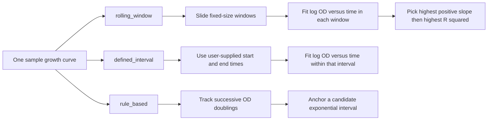
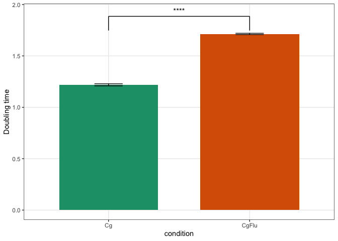

<!-- README.md is generated from README.Rmd. Please edit that file -->

# growkar 

[](https://github.com/sethiyap/growkar/actions/workflows/R-CMD-check.yaml)
[](https://github.com/sethiyap/growkar/actions/workflows/bioccheck.yaml)
[](https://opensource.org/licenses/MIT)

`growkar` is an R package for microbial growth curve analysis from
optical density (OD) time-series data. It provides a tidy workflow for
converting input data, validating growth measurements, plotting growth
curves, estimating growth rate and doubling time, detecting exponential
phase, fitting logistic or Gompertz growth models, and coercing data to
`SummarizedExperiment` for Bioconductor-style workflows.

The package is designed for tidy analysis of microbial growth data using
the canonical columns `sample`, `time`, and `od`. It is especially
useful for plotting growth curves from tidy input and returning
`ggplot2` objects that can be customized into publication-ready figures.

Input data can be supplied in either:

- tidy format with columns `sample`, `time`, and `od`
- wide format with time in the first column and sample names in the
  remaining column names

If replicate identifiers are encoded in sample names, use a consistent
suffix such as `_R1` or `_1` so `growkar` can infer replicate metadata
reliably.

Common instrument-style column labels such as `Time [s]`, `Time [h]`,
`Sample`, `Well`, `OD600`, `OD 600`, and `Absorbance 600` are detected
automatically where possible, which helps when importing exports from
instruments such as Agilent readers, BioTek/Cytation 3, LogPhase 600,
and similar OD600 workflows.

## Installation

``` r
remotes::install_github("sethiyap/growkar")
```

## Example dataset

``` r
library(growkar)
data(yeast_growth_data)

head(yeast_growth_data)
#> # A tibble: 6 × 10
#>    Time Cg_R1 Cg_R2 Cg_R3 CgFlu_R1 CgFlu_R2 CgFlu_R3 YPD_R1 YPD_R2 YPD_R3
#>   <dbl> <dbl> <dbl> <dbl>    <dbl>    <dbl>    <dbl>  <dbl>  <dbl>  <dbl>
#> 1   0   0.115 0.116 0.117    0.131    0.133    0.132  0.105  0.105  0.104
#> 2   0.5 0.116 0.118 0.117    0.132    0.133    0.134  0.104  0.104  0.104
#> 3   1   0.118 0.119 0.118    0.134    0.136    0.138  0.104  0.104  0.104
#> 4   1.5 0.121 0.123 0.121    0.139    0.142    0.144  0.104  0.104  0.104
#> 5   2   0.126 0.129 0.126    0.15     0.151    0.151  0.104  0.104  0.104
#> 6   2.5 0.136 0.139 0.136    0.165    0.168    0.166  0.104  0.104  0.104
```

## Convert data to tidy format

**What it does:** `as_tidy_growth_data()` converts growth data into the
canonical tidy format used throughout the package, with core columns
`sample`, `time`, and `od`.

**Why use it:** A standard tidy structure makes downstream validation,
visualization, empirical summaries, and model fitting easier and more
consistent.

**Minimal example:**

``` r
tidy_data <- as_tidy_growth_data(yeast_growth_data)
head(tidy_data)
#> # A tibble: 6 × 5
#>    time sample      od condition replicate
#>   <dbl> <chr>    <dbl> <chr>     <chr>    
#> 1     0 Cg_R1    0.115 Cg        R1       
#> 2     0 Cg_R2    0.116 Cg        R2       
#> 3     0 Cg_R3    0.117 Cg        R3       
#> 4     0 CgFlu_R1 0.131 CgFlu     R1       
#> 5     0 CgFlu_R2 0.133 CgFlu     R2       
#> 6     0 CgFlu_R3 0.132 CgFlu     R3
```

## SummarizedExperiment interop

**What it does:** `as_summarized_experiment()` converts growth data into
a `SummarizedExperiment` with an `od` assay, time in `rowData()`, and
sample metadata in `colData()`.

**Why use it:** It provides a lightweight Bioconductor-compatible
container without replacing the tidy tibble workflow used throughout
`growkar`.

**Minimal example:**

``` r
se <- as_summarized_experiment(yeast_growth_data)
se
#> class: SummarizedExperiment 
#> dim: 49 9 
#> metadata(0):
#> assays(1): od
#> rownames(49): 0 0.5 ... 23.5 24
#> rowData names(1): time
#> colnames(9): CgFlu_R1 CgFlu_R2 ... YPD_R2 YPD_R3
#> colData names(3): sample condition replicate
```

## Validate tidy input

**What it does:** `validate_growth_data()` checks that tidy growth data
has the required columns and valid values.

**Why use it:** It helps catch structural or value problems before
downstream analysis.

**Minimal example:**

``` r
validate_growth_data(tidy_data)
#> # A tibble: 441 × 5
#>     time sample      od condition replicate
#>    <dbl> <chr>    <dbl> <chr>     <chr>    
#>  1   0   Cg_R1    0.115 Cg        R1       
#>  2   0   Cg_R2    0.116 Cg        R2       
#>  3   0   Cg_R3    0.117 Cg        R3       
#>  4   0   CgFlu_R1 0.131 CgFlu     R1       
#>  5   0   CgFlu_R2 0.133 CgFlu     R2       
#>  6   0   CgFlu_R3 0.132 CgFlu     R3       
#>  7   0   YPD_R1   0.105 YPD       R1       
#>  8   0   YPD_R2   0.105 YPD       R2       
#>  9   0   YPD_R3   0.104 YPD       R3       
#> 10   0.5 Cg_R1    0.116 Cg        R1       
#> # ℹ 431 more rows
```

## Plot growth curves

**What it does:** `plot_growth_curve()` visualizes OD over time and
returns a `ggplot` object.

**Why use it:** It is useful for quick quality control and for comparing
growth patterns across samples. Because the output is a `ggplot` object,
users can further customize it with `ggplot2`.

**Minimal example:**

``` r
p <- plot_growth_curve(
  tidy_data,
  average_replicates = TRUE,
  colour_col = "condition",
  palette_name = "Dark2"
)
p
```


To view individual replicates as separate panels, use
`facet_col = "replicate"` with `average_replicates = FALSE`.

``` r
p_rep <- plot_growth_curve(
  tidy_data,
  average_replicates = FALSE,
  colour_col = "condition",
  facet_col = "replicate",
  palette_name = "Dark2"
)

p_rep
```


## Estimate growth rate

**What it does:** `compute_growth_rate()` estimates the specific growth
rate from `log(od)` versus time. In the returned table, `mu` is the
estimated growth rate.

**Why use it:** It is useful for estimating exponential growth directly
from observed data, using methods such as `"rolling_window"`,
`"defined_interval"`, and `"rule_based"`.

Method options:

- `"rolling_window"` scans rolling windows across the time series and
  selects the window with the strongest positive log-linear slope.
- `"defined_interval"` fits the growth rate over a user-supplied start
  and end time interval.
- `"rule_based"` uses OD-doubling heuristics to anchor the exponential
  interval from the observed curve.

Method schematic:


``` mermaid
flowchart LR
  A[One sample growth curve] --> B[rolling_window]
  B --> B1[Slide fixed-size windows]
  B1 --> B2[Fit log OD versus time in each window]
  B2 --> B3[Pick highest positive slope then highest R squared]

  A --> C[defined_interval]
  C --> C1[Use user-supplied start and end times]
  C1 --> C2[Fit log OD versus time within that interval]

  A --> D[rule_based]
  D --> D1[Track successive OD doublings]
  D1 --> D2[Anchor a candidate exponential interval]
```

**Minimal example:**

``` r
library(dplyr)
#> 
#> Attaching package: 'dplyr'
#> The following objects are masked from 'package:stats':
#> 
#>     filter, lag
#> The following objects are masked from 'package:base':
#> 
#>     intersect, setdiff, setequal, union
library(knitr)

sample_id <- unique(tidy_data$sample)[1]

gr <- compute_growth_rate(
  filter(tidy_data, sample == sample_id),
  method = "rolling_window"
)

knitr::kable(gr, digits = 3)
```

| sample | mu | start_time | end_time | r_squared | method | n_points | degraded | note |
|:---|---:|---:|---:|---:|:---|---:|:---|:---|
| Cg_R1 | 0.576 | 4.5 | 6.5 | 1 | rolling_window | 5 | FALSE | rolling_window_ranked |

## Compute doubling time

**What it does:** `compute_doubling_time()` calculates doubling time
from growth rate as `log(2) / mu`.

**Why use it:** It converts the estimated growth rate into a more
biologically interpretable measure of growth kinetics. This is the
low-level helper when you already have one or more growth-rate
estimates. For a combined table across all samples, use
`summarize_growth_metrics()`.

**Minimal example:**

``` r
doubling_time_tbl <- tibble::tibble(
  sample = gr$sample,
  growth_rate = gr$mu,
  doubling_time = compute_doubling_time(gr$mu)
)

knitr::kable(doubling_time_tbl, digits = 3)
```

| sample | growth_rate | doubling_time |
|:-------|------------:|--------------:|
| Cg_R1  |       0.576 |         1.204 |

## Summarize growth metrics across samples

**What it does:** `summarize_growth_metrics()` computes growth rate and
doubling time across all samples.

**Why use it:** It is useful for comparing strains, conditions, or
replicates in one tidy summary table. Internally, it derives doubling
time from the estimated growth rate using `compute_doubling_time()`.

**Minimal example:**

``` r
metrics <- summarize_growth_metrics(tidy_data)
#> Warning: Sample `YPD_R1`: Exponential phase detection did not yield a positive
#> growth slope (rolling_window_ranked).
#> Warning: Sample `YPD_R2`: Exponential phase detection did not yield a positive
#> growth slope (rolling_window_ranked).
knitr::kable(metrics, digits = 3)
```

| sample | mu | start_time | end_time | r_squared | method | n_points | degraded | note | doubling_time |
|:---|---:|---:|---:|---:|:---|---:|:---|:---|---:|
| Cg_R1 | 0.576 | 4.5 | 6.5 | 1.000 | rolling_window | 5 | FALSE | rolling_window_ranked | 1.204 |
| Cg_R2 | 0.560 | 4.5 | 6.5 | 1.000 | rolling_window | 5 | FALSE | rolling_window_ranked | 1.238 |
| Cg_R3 | 0.571 | 4.5 | 6.5 | 0.999 | rolling_window | 5 | FALSE | rolling_window_ranked | 1.214 |
| CgFlu_R1 | 0.403 | 4.5 | 6.5 | 1.000 | rolling_window | 5 | FALSE | rolling_window_ranked | 1.719 |
| CgFlu_R2 | 0.407 | 4.5 | 6.5 | 1.000 | rolling_window | 5 | FALSE | rolling_window_ranked | 1.702 |
| CgFlu_R3 | 0.403 | 4.5 | 6.5 | 1.000 | rolling_window | 5 | FALSE | rolling_window_ranked | 1.721 |
| YPD_R1 | NA | NA | NA | NA | rolling_window | 5 | FALSE | rolling_window_ranked | NA |
| YPD_R2 | NA | NA | NA | NA | rolling_window | 5 | FALSE | rolling_window_ranked | NA |
| YPD_R3 | 0.004 | 18.0 | 20.0 | 0.500 | rolling_window | 5 | FALSE | rolling_window_ranked | 179.350 |

To summarize replicate-level doubling time by condition and compare each
group to a reference condition, supply `comparison_col` and
`compare_to`.

``` r
dt_stats <- summarize_growth_metrics(
  tidy_data,
  method = "rolling_window",
  comparison_col = "condition",
  compare_to = "Cg",
  select_replicates = c("R1", "R2", "R3")
)
#> Warning: Sample `YPD_R1`: Exponential phase detection did not yield a positive
#> growth slope (rolling_window_ranked).
#> Warning: Sample `YPD_R2`: Exponential phase detection did not yield a positive
#> growth slope (rolling_window_ranked).

knitr::kable(dt_stats, digits = 3)
```

| condition | mean_mu | mean_doubling_time | sd_doubling_time | n_replicates | error_bar | p_value | p_value_label |
|:---|---:|---:|---:|---:|---:|---:|:---|
| Cg | 0.569 | 1.219 | 0.017 | 3 | 0.010 | NA | ref |
| CgFlu | 0.404 | 1.714 | 0.010 | 3 | 0.006 | 0 | \*\*\*\* |
| YPD | 0.004 | 179.350 | NA | 1 | NA | NA | NA |

This summary includes numeric p-values in `p_value` and asterisk-form
significance labels in `p_value_label`.

## Detect exponential phase

**What it does:** `detect_exponential_phase()` identifies likely
exponential-phase windows automatically.

**Why use it:** It helps show which time interval is most consistent
with exponential growth and supports interpretation of the growth-rate
estimate.

**Minimal example:**

``` r
phase_tbl <- detect_exponential_phase(
  filter(tidy_data, sample == sample_id)
)

knitr::kable(head(phase_tbl), digits = 3)
```

| sample | rank | start_time | end_time | slope | r_squared | n_points | selection_reason | degraded |
|:---|---:|---:|---:|---:|---:|---:|:---|:---|
| Cg_R1 | 1 | 4.5 | 6.5 | 0.576 | 1.000 | 5 | rolling_window_ranked | FALSE |
| Cg_R1 | 2 | 4.0 | 6.0 | 0.551 | 0.997 | 5 | rolling_window_ranked | FALSE |
| Cg_R1 | 3 | 5.0 | 7.0 | 0.551 | 0.997 | 5 | rolling_window_ranked | FALSE |
| Cg_R1 | 4 | 3.5 | 5.5 | 0.490 | 0.990 | 5 | rolling_window_ranked | FALSE |
| Cg_R1 | 5 | 5.5 | 7.5 | 0.490 | 0.991 | 5 | rolling_window_ranked | FALSE |
| Cg_R1 | 6 | 6.0 | 8.0 | 0.414 | 0.987 | 5 | rolling_window_ranked | FALSE |

## Plot doubling time

**What it does:** `plot_doubling_time()` summarizes replicate-level
doubling times as a bar plot with error bars and optional comparison
brackets annotated with significance asterisks.

**Why use it:** It is useful for comparing conditions or strains at the
doubling-time level while showing replicate variability and a
reference-group comparison.

**Minimal example:**

``` r
plot_doubling_time(
  tidy_data,
  comparison_col = "condition",
  compare_to = "Cg",
  exclude_groups = "YPD",
  select_replicates = c("R1", "R2", "R3"),
  palette_name = "Dark2"
)
#> Warning: Sample `YPD_R1`: Exponential phase detection did not yield a positive
#> growth slope (rolling_window_ranked).
#> Warning: Sample `YPD_R2`: Exponential phase detection did not yield a positive
#> growth slope (rolling_window_ranked).
```


## Fit a growth model

**What it does:** `fit_growth_curve()` fits a logistic or Gompertz
growth model to one sample.

**Why use it:** It is useful when a smooth model-based summary of the
full growth curve is preferred over a purely empirical estimate.

**Minimal example:**

``` r
fit <- fit_growth_curve(
  filter(tidy_data, sample == sample_id),
  model = "logistic"
)

fit
#> <growkar_fit> sample=Cg_R1, model=logistic, status=converged, n_points=49
```

## Extract fitted parameters

**What it does:** `extract_params()` extracts fitted coefficients and
model-derived quantities such as the asymptote and model-based doubling
time.

**Why use it:** It is useful for reporting fitted summaries in a tidy
format.

**Minimal example:**

``` r
params <- extract_params(fit)
params
#> # A tibble: 1 × 6
#>   sample model    asymptote     r    t0 doubling_time_model
#>   <chr>  <chr>        <dbl> <dbl> <dbl>               <dbl>
#> 1 Cg_R1  logistic      2.03 0.777  6.97               0.892
```

## Plot fitted curves

**What it does:** `plot_fitted_curve()` overlays observed OD points and
the fitted growth model, and returns a `ggplot` object.

**Why use it:** It is useful for visually checking model fit quality.
Because the output is a `ggplot` object, users can further customize it
with `ggplot2`.

**Minimal example:**

``` r
pf <- plot_fitted_curve(fit)
pf
```



To fit and view individual replicates as separate panels from raw data,
use `facet_col = "replicate"` with `average_replicates = FALSE`.

``` r
pf_rep <- plot_fitted_curve(
  tidy_data,
  model = "logistic",
  average_replicates = FALSE,
  colour_col = "condition",
  facet_col = "replicate",
  palette_name = "Dark2"
)

pf_rep
```


## Supported API

The supported interface is the current tidy workflow:

- `as_tidy_growth_data()`
- `validate_growth_data()`
- `compute_growth_rate()`
- `summarize_growth_metrics()`
- `detect_exponential_phase()`
- `fit_growth_curve()`

## Contributing and issues

Bug reports, feature requests, and suggestions are welcome at:

<https://github.com/sethiyap/growkar/issues>

## License

MIT License
