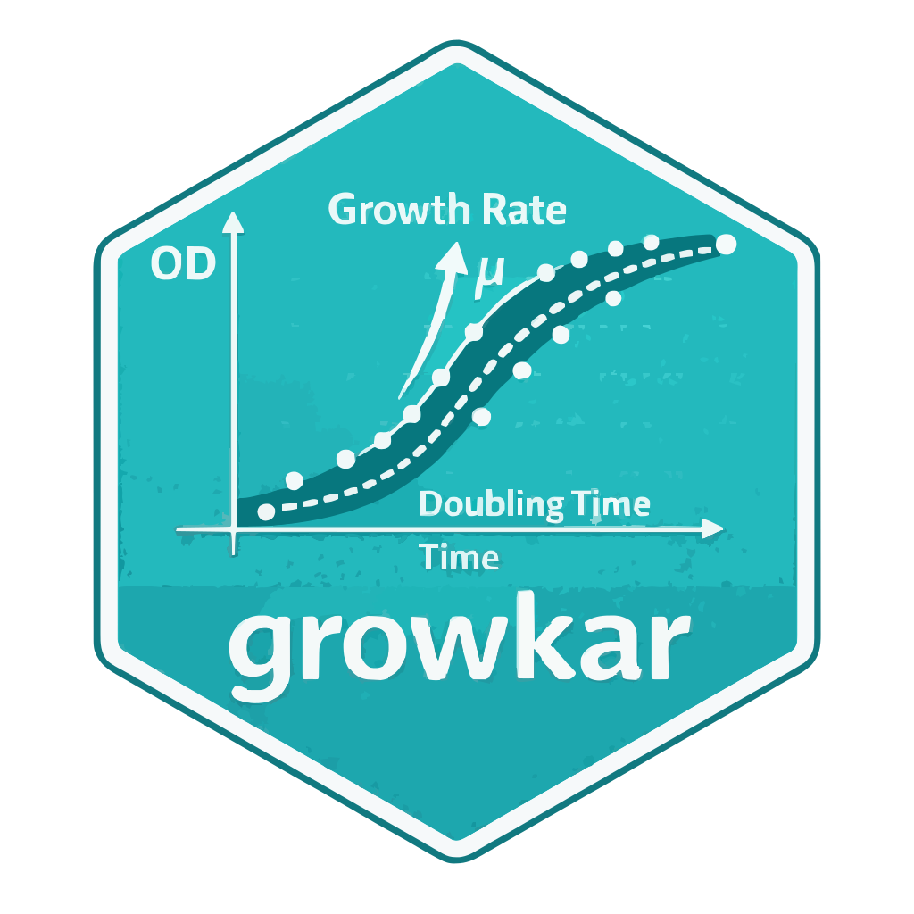
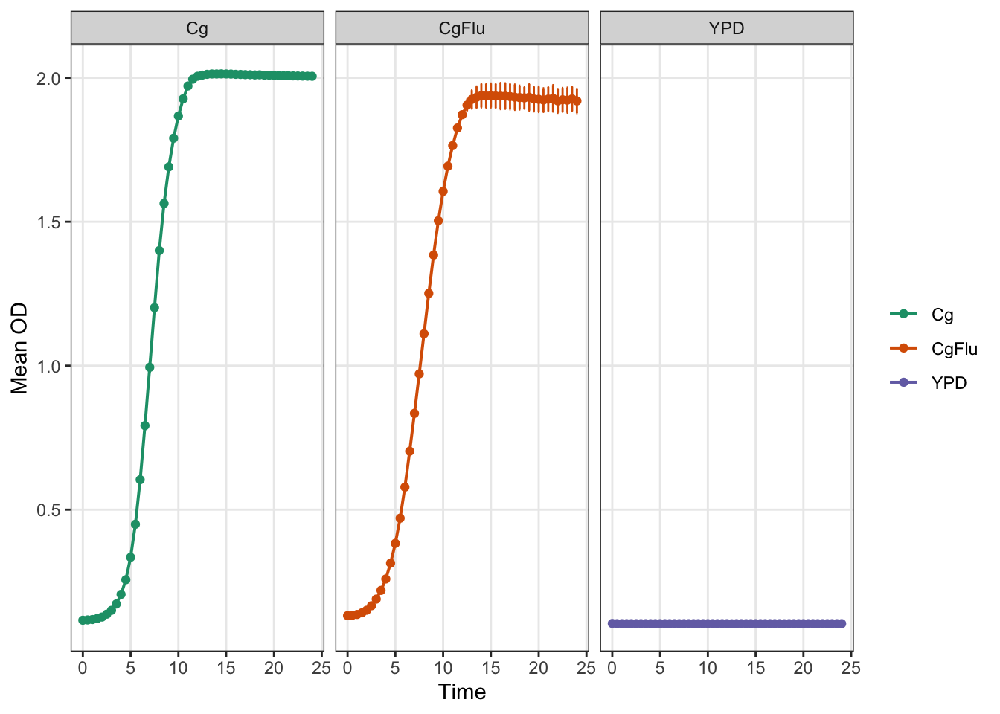
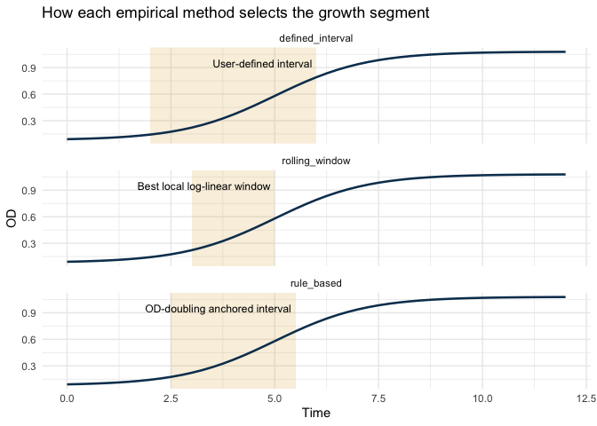
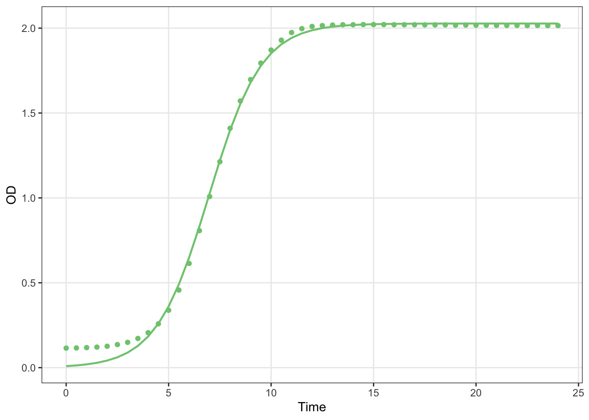
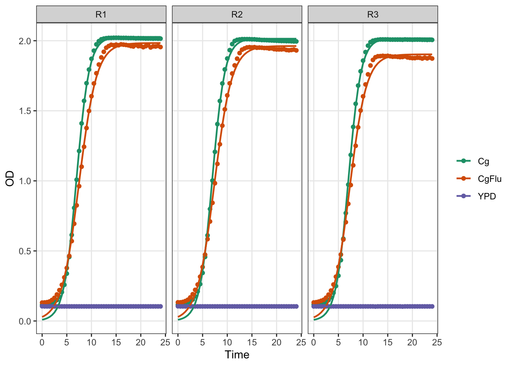

<!-- README.md is generated from README.Rmd. Please edit that file -->

# growkar <a href="https://sethiyap.github.io/growkar"></a>

<p>

<em>A toolkit for high-throughput growth curve analysis</em>
</p>

[](https://github.com/sethiyap/growkar/actions/workflows/R-CMD-check.yaml)
[](https://github.com/sethiyap/growkar/actions/workflows/bioccheck.yaml)
[](https://opensource.org/licenses/MIT)

`growkar` is a Bioconductor-oriented R package for the analysis of
high-throughput microbial growth experiments, such as plate-based
optical density assays. It provides infrastructure for extracting
quantitative growth phenotypes, including lag time, growth rate,
doubling time, and carrying capacity, from time-series measurements, and
for representing assay data and derived phenotypes in Bioconductor
containers such as `SummarizedExperiment`. This makes it possible to
integrate growth-based phenotyping with genomic, transcriptomic, and
other omics data in broader functional genomics and microbial systems
biology workflows.

Data generated from Agilent microplate readers, BioTek Cytation
instruments, and other OD600-based microbial growth measurement
platforms can be directly analysed using `growkar`.

`growkar` is built around `SummarizedExperiment` as its canonical data
model. Tidy tables using the canonical columns `sample`, `time`, and
`od`, and wide plate-reader exports, are accepted as import adapters and
converted into the SE representation early in the workflow. Plotting
functions return `ggplot2` objects that can be customized into
publication-ready figures, while SE-aware helpers store derived results
in `metadata()` for downstream analysis. Core analysis functions accept
tidy tables, wide plate-reader exports, and `SummarizedExperiment`
input.

## Input formats

Input data can be supplied in either:

- tidy format with columns `sample`, `time`, and `od`
- wide format with time in the first column and sample names in the
  remaining column names

If replicate identifiers are encoded in sample names, use a consistent
suffix such as `_R1` or `_1` so `growkar` can infer replicate metadata
reliably.

## Data model

- primary object: `SummarizedExperiment`
- assay layout: rows are timepoints and columns are samples in
  `assay(se, "od")`
- sample annotations live in `colData(se)`
- timepoint annotations live in `rowData(se)`
- derived summaries and fit results live in `metadata(se)`
- tidy and wide inputs are accepted and converted into this SE
  representation

## Installation

``` r
remotes::install_github("sethiyap/growkar")
```

## Example dataset

``` r
library(growkar)
data(yeast_growth_data)

head(yeast_growth_data)
#> # A tibble: 6 × 10
#>    Time Cg_R1 Cg_R2 Cg_R3 CgFlu_R1 CgFlu_R2 CgFlu_R3 YPD_R1 YPD_R2 YPD_R3
#>   <dbl> <dbl> <dbl> <dbl>    <dbl>    <dbl>    <dbl>  <dbl>  <dbl>  <dbl>
#> 1   0   0.115 0.116 0.117    0.131    0.133    0.132  0.105  0.105  0.104
#> 2   0.5 0.116 0.118 0.117    0.132    0.133    0.134  0.104  0.104  0.104
#> 3   1   0.118 0.119 0.118    0.134    0.136    0.138  0.104  0.104  0.104
#> 4   1.5 0.121 0.123 0.121    0.139    0.142    0.144  0.104  0.104  0.104
#> 5   2   0.126 0.129 0.126    0.15     0.151    0.151  0.104  0.104  0.104
#> 6   2.5 0.136 0.139 0.136    0.165    0.168    0.166  0.104  0.104  0.104
```

## Import and validate data

**What it does:** `as_tidy_growth_data()` converts growth data into a
tidy inspection/export format with core columns `sample`, `time`, and
`od`.

**Why use it:** It is the import layer for user-supplied assay tables.
Once the data have been standardized and checked, the primary workflow
should continue with a `SummarizedExperiment`.

**Minimal example:**

``` r
tidy_data <- as_tidy_growth_data(yeast_growth_data)
validate_growth_data(tidy_data)
#> # A tibble: 441 × 5
#>     time sample      od condition replicate
#>    <dbl> <chr>    <dbl> <chr>     <chr>    
#>  1   0   Cg_R1    0.115 Cg        R1       
#>  2   0   Cg_R2    0.116 Cg        R2       
#>  3   0   Cg_R3    0.117 Cg        R3       
#>  4   0   CgFlu_R1 0.131 CgFlu     R1       
#>  5   0   CgFlu_R2 0.133 CgFlu     R2       
#>  6   0   CgFlu_R3 0.132 CgFlu     R3       
#>  7   0   YPD_R1   0.105 YPD       R1       
#>  8   0   YPD_R2   0.105 YPD       R2       
#>  9   0   YPD_R3   0.104 YPD       R3       
#> 10   0.5 Cg_R1    0.116 Cg        R1       
#> # ℹ 431 more rows
head(tidy_data)
#> # A tibble: 6 × 5
#>    time sample      od condition replicate
#>   <dbl> <chr>    <dbl> <chr>     <chr>    
#> 1     0 Cg_R1    0.115 Cg        R1       
#> 2     0 Cg_R2    0.116 Cg        R2       
#> 3     0 Cg_R3    0.117 Cg        R3       
#> 4     0 CgFlu_R1 0.131 CgFlu     R1       
#> 5     0 CgFlu_R2 0.133 CgFlu     R2       
#> 6     0 CgFlu_R3 0.132 CgFlu     R3
```

## Create the canonical SummarizedExperiment

**What it does:** `as_summarized_experiment()` converts growth data
directly into a `SummarizedExperiment` with an `od` assay, time in
`rowData()`, and sample metadata in `colData()`.

**Why use it:** This is the primary data object for analysis, plotting,
and Bioconductor integration.

**Minimal example:**

``` r
se <- as_summarized_experiment(tidy_data)
se
#> class: SummarizedExperiment 
#> dim: 49 9 
#> metadata(1): growkar_schema
#> assays(1): od
#> rownames(49): 0 0.5 ... 23.5 24
#> rowData names(1): time
#> colnames(9): Cg_R1 Cg_R2 ... YPD_R2 YPD_R3
#> colData names(3): sample condition replicate
```

Useful accessors for SE-based workflows include `growth_assay()`,
`timepoints()`, `sample_data()`, and `growth_model_fits()`.

## SE-native workflow

**What it does:** `as_growkar()` creates a lightweight processed
`growkar` object that can be coerced to `SummarizedExperiment`, and
`growth_metrics()` stores derived phenotype summaries in `metadata()`.

**Why use it:** This is the preferred path when growth phenotypes need
to be kept alongside sample metadata and reused in larger Bioconductor
workflows.

**Minimal example:**

``` r
growkar_obj <- as_growkar(tidy_data)
se_from_obj <- methods::as(growkar_obj, "SummarizedExperiment")
se_from_obj <- growth_metrics(
  se_from_obj,
  method = "rolling_window",
  average_replicates = TRUE
)
S4Vectors::metadata(se_from_obj)$growth_metrics
#> # A tibble: 3 × 10
#>   sample      mu start_time end_time r_squared method    n_points degraded note 
#>   <chr>    <dbl>      <dbl>    <dbl>     <dbl> <chr>        <int> <lgl>    <chr>
#> 1 Cg     0.569          4.5      6.5     1.000 rolling_…        5 FALSE    roll…
#> 2 CgFlu  0.404          4.5      6.5     1.000 rolling_…        5 FALSE    roll…
#> 3 YPD    0.00128       12.5     14.5     0.500 rolling_…        5 FALSE    roll…
#> # ℹ 1 more variable: doubling_time <dbl>
```

## Plot growth curves

**What it does:** `plot_growth_curve()` visualizes OD over time and
returns a `ggplot` object.

**Why use it:** It is useful for quick quality control and for comparing
growth patterns across samples. Because the output is a `ggplot` object,
users can further customize it with `ggplot2`.

**Minimal example:**

``` r
p <- plot_growth_curve(
  se,
  average_replicates = TRUE,
  colour_col = "condition",
  palette_name = "Dark2"
)
p
```


To view individual replicates as separate panels, use
`facet_col = "replicate"` with `average_replicates = FALSE`.

``` r
p_rep <- plot_growth_curve(
  se,
  average_replicates = FALSE,
  colour_col = "condition",
  facet_col = "replicate",
  palette_name = "Dark2"
)

p_rep
```


To average replicates first and facet by sample family automatically,
use `plot_growth_curve_facets()`.

``` r
p_facet <- plot_growth_curve_facets(
  yeast_growth_data,
  palette_name = "Dark2"
)

p_facet
```



## Detect exponential phase

**What it does:** `detect_exponential_phase()` identifies likely
exponential-phase windows automatically.

**Why use it:** It is a diagnostic and explanatory function. Use it when
you want to inspect which time interval appears most consistent with
exponential growth before moving to final summary metrics.

This schematic shows how the candidate interval is chosen on a mock
growth curve for each empirical method.

``` r
mock_curve <- tibble::tibble(
  time = seq(0, 12, by = 0.25),
  od = 0.08 + 1 / (1 + exp(-0.9 * (time - 5)))
)

method_windows <- tibble::tribble(
  ~method,            ~xmin, ~xmax, ~label,
  "rolling_window",    3.0,   5.0,  "Best local log-linear window",
  "defined_interval",  2.0,   6.0,  "User-defined interval",
  "rule_based",        2.5,   5.5,  "OD-doubling anchored interval"
)

method_plot_data <- dplyr::bind_rows(
  lapply(method_windows$method, function(method_name) {
    dplyr::mutate(mock_curve, method = method_name)
  })
)

ggplot2::ggplot(method_plot_data, ggplot2::aes(time, od)) +
  ggplot2::geom_rect(
    data = method_windows,
    ggplot2::aes(xmin = xmin, xmax = xmax, ymin = -Inf, ymax = Inf),
    inherit.aes = FALSE,
    fill = "#DDAA33",
    alpha = 0.18
  ) +
  ggplot2::geom_line(linewidth = 0.9, colour = "#0B3C5D") +
  ggplot2::geom_text(
    data = dplyr::mutate(method_windows, x = xmax - 0.1, y = 0.95),
    ggplot2::aes(x = x, y = y, label = label),
    inherit.aes = FALSE,
    hjust = 1,
    size = 3.2
  ) +
  ggplot2::facet_wrap(~method, ncol = 1) +
  ggplot2::labs(x = "Time", y = "OD", title = "How each empirical method selects the growth segment") +
  ggplot2::theme_minimal(base_size = 11)
```



**Minimal example:**

``` r
library(dplyr)
#> 
#> Attaching package: 'dplyr'
#> The following objects are masked from 'package:stats':
#> 
#>     filter, lag
#> The following objects are masked from 'package:base':
#> 
#>     intersect, setdiff, setequal, union
library(knitr)

phase_tbl <- detect_exponential_phase(se)

knitr::kable(head(phase_tbl), digits = 3)
```

| sample | rank | start_time | end_time | slope | r_squared | n_points | selection_reason | degraded |
|:---|---:|---:|---:|---:|---:|---:|:---|:---|
| Cg_R1 | 1 | 4.5 | 6.5 | 0.576 | 1.000 | 5 | rolling_window_ranked | FALSE |
| Cg_R1 | 2 | 4.0 | 6.0 | 0.551 | 0.997 | 5 | rolling_window_ranked | FALSE |
| Cg_R1 | 3 | 5.0 | 7.0 | 0.551 | 0.997 | 5 | rolling_window_ranked | FALSE |
| Cg_R1 | 4 | 3.5 | 5.5 | 0.490 | 0.990 | 5 | rolling_window_ranked | FALSE |
| Cg_R1 | 5 | 5.5 | 7.5 | 0.490 | 0.991 | 5 | rolling_window_ranked | FALSE |
| Cg_R1 | 6 | 6.0 | 8.0 | 0.414 | 0.987 | 5 | rolling_window_ranked | FALSE |

## Estimate growth rate

**What it does:** `compute_growth_rate()` estimates the specific growth
rate from `log(od)` versus time. In the returned table, `mu` is the
estimated growth rate.

**Why use it:** It is useful for estimating exponential growth directly
from observed data, using methods such as `"rolling_window"`,
`"defined_interval"`, and `"rule_based"`.

Briefly, growth rate is estimated as the slope of `log(OD)` versus time
over the selected interval, and doubling time is then calculated as
`log(2) / mu`.

Method options:

- `"rolling_window"` scans rolling windows across the time series and
  selects the window with the strongest positive log-linear slope.
- `"defined_interval"` fits the growth rate over a user-supplied start
  and end time interval. You can provide one interval for all samples or
  a per-sample interval table.
- `"rule_based"` starts from a reference OD, finds the nearest
  successive OD doublings, and uses the interval between those doubling
  anchors to estimate growth.

**Minimal example:**

``` r
gr <- compute_growth_rate(se, method = "rolling_window")
#> Warning: Sample `YPD_R1`: Exponential phase detection did not yield a positive
#> growth slope (rolling_window_ranked).
#> Warning: Sample `YPD_R2`: Exponential phase detection did not yield a positive
#> growth slope (rolling_window_ranked).

knitr::kable(head(gr), digits = 3)
```

| sample | mu | start_time | end_time | r_squared | method | n_points | degraded | note |
|:---|---:|---:|---:|---:|:---|---:|:---|:---|
| Cg_R1 | 0.576 | 4.5 | 6.5 | 1.000 | rolling_window | 5 | FALSE | rolling_window_ranked |
| Cg_R2 | 0.560 | 4.5 | 6.5 | 1.000 | rolling_window | 5 | FALSE | rolling_window_ranked |
| Cg_R3 | 0.571 | 4.5 | 6.5 | 0.999 | rolling_window | 5 | FALSE | rolling_window_ranked |
| CgFlu_R1 | 0.403 | 4.5 | 6.5 | 1.000 | rolling_window | 5 | FALSE | rolling_window_ranked |
| CgFlu_R2 | 0.407 | 4.5 | 6.5 | 1.000 | rolling_window | 5 | FALSE | rolling_window_ranked |
| CgFlu_R3 | 0.403 | 4.5 | 6.5 | 1.000 | rolling_window | 5 | FALSE | rolling_window_ranked |

Use the same interval for all samples:

``` r
gr_defined_all <- compute_growth_rate(
  se,
  method = "defined_interval",
  interval = c(2, 6)
)
#> Warning: Sample `YPD_R1`: Defined interval did not yield a positive growth
#> slope.
#> Warning: Sample `YPD_R2`: Defined interval did not yield a positive growth
#> slope.
#> Warning: Sample `YPD_R3`: Defined interval did not yield a positive growth
#> slope.

knitr::kable(head(gr_defined_all), digits = 3)
```

| sample | mu | start_time | end_time | r_squared | method | n_points | degraded | note |
|:---|---:|---:|---:|---:|:---|---:|:---|:---|
| Cg_R1 | 0.400 | 2 | 6 | 0.956 | defined_interval | 9 | FALSE | defined_interval_fit |
| Cg_R2 | 0.394 | 2 | 6 | 0.959 | defined_interval | 9 | FALSE | defined_interval_fit |
| Cg_R3 | 0.386 | 2 | 6 | 0.953 | defined_interval | 9 | FALSE | defined_interval_fit |
| CgFlu_R1 | 0.339 | 2 | 6 | 0.990 | defined_interval | 9 | FALSE | defined_interval_fit |
| CgFlu_R2 | 0.342 | 2 | 6 | 0.989 | defined_interval | 9 | FALSE | defined_interval_fit |
| CgFlu_R3 | 0.345 | 2 | 6 | 0.988 | defined_interval | 9 | FALSE | defined_interval_fit |

Use different intervals for different samples:

``` r
interval_tbl <- tibble::tibble(
  sample = unique(gr$sample)[1:2],
  start_time = c(2, 3),
  end_time = c(5, 6)
)

se_subset <- se[, SummarizedExperiment::colData(se)$sample %in% interval_tbl$sample]

gr_defined_by_sample <- compute_growth_rate(
  se_subset,
  method = "defined_interval",
  interval = interval_tbl
)

knitr::kable(gr_defined_by_sample, digits = 3)
```

| sample | mu | start_time | end_time | r_squared | method | n_points | degraded | note |
|:---|---:|---:|---:|---:|:---|---:|:---|:---|
| Cg_R1 | 0.326 | 2 | 5 | 0.955 | defined_interval | 7 | FALSE | defined_interval_fit |
| Cg_R2 | 0.468 | 3 | 6 | 0.985 | defined_interval | 7 | FALSE | defined_interval_fit |

## Compute doubling time

**What it does:** `compute_doubling_time()` calculates doubling time
from growth rate as `log(2) / mu`.

**Why use it:** It converts the estimated growth rate into a more
biologically interpretable measure of growth kinetics. This is the
low-level helper when you already have one or more growth-rate
estimates. For a combined table across all samples, use
`summarize_growth_metrics()`.

**Minimal example:**

``` r
doubling_time_tbl <- tibble::tibble(
  sample = gr$sample,
  growth_rate = gr$mu,
  doubling_time = compute_doubling_time(gr$mu)
)

knitr::kable(doubling_time_tbl, digits = 3)
```

| sample   | growth_rate | doubling_time |
|:---------|------------:|--------------:|
| Cg_R1    |       0.576 |         1.204 |
| Cg_R2    |       0.560 |         1.238 |
| Cg_R3    |       0.571 |         1.214 |
| CgFlu_R1 |       0.403 |         1.719 |
| CgFlu_R2 |       0.407 |         1.702 |
| CgFlu_R3 |       0.403 |         1.721 |
| YPD_R1   |          NA |            NA |
| YPD_R2   |          NA |            NA |
| YPD_R3   |       0.004 |       179.350 |

## Summarize growth metrics across samples

**What it does:** `summarize_growth_metrics()` computes growth rate and
doubling time across all samples.

**Why use it:** It is the reporting function for final sample- or
group-level results. Use it when you want a tidy table for comparing
strains, conditions, or replicates. Internally, it derives doubling time
from the estimated growth rate using `compute_doubling_time()`.

**Minimal example:**

``` r
metrics <- summarize_growth_metrics(se)
#> Warning: Sample `YPD_R1`: Exponential phase detection did not yield a positive
#> growth slope (rolling_window_ranked).
#> Warning: Sample `YPD_R2`: Exponential phase detection did not yield a positive
#> growth slope (rolling_window_ranked).
knitr::kable(metrics, digits = 3)
```

| sample | mu | start_time | end_time | r_squared | method | n_points | degraded | note | doubling_time |
|:---|---:|---:|---:|---:|:---|---:|:---|:---|---:|
| Cg_R1 | 0.576 | 4.5 | 6.5 | 1.000 | rolling_window | 5 | FALSE | rolling_window_ranked | 1.204 |
| Cg_R2 | 0.560 | 4.5 | 6.5 | 1.000 | rolling_window | 5 | FALSE | rolling_window_ranked | 1.238 |
| Cg_R3 | 0.571 | 4.5 | 6.5 | 0.999 | rolling_window | 5 | FALSE | rolling_window_ranked | 1.214 |
| CgFlu_R1 | 0.403 | 4.5 | 6.5 | 1.000 | rolling_window | 5 | FALSE | rolling_window_ranked | 1.719 |
| CgFlu_R2 | 0.407 | 4.5 | 6.5 | 1.000 | rolling_window | 5 | FALSE | rolling_window_ranked | 1.702 |
| CgFlu_R3 | 0.403 | 4.5 | 6.5 | 1.000 | rolling_window | 5 | FALSE | rolling_window_ranked | 1.721 |
| YPD_R1 | NA | NA | NA | NA | rolling_window | 5 | FALSE | rolling_window_ranked | NA |
| YPD_R2 | NA | NA | NA | NA | rolling_window | 5 | FALSE | rolling_window_ranked | NA |
| YPD_R3 | 0.004 | 18.0 | 20.0 | 0.500 | rolling_window | 5 | FALSE | rolling_window_ranked | 179.350 |

To summarize replicate-level doubling time by condition and compare each
group to a reference condition, supply `comparison_col` and
`compare_to`.

``` r
dt_stats <- summarize_growth_metrics(
  se,
  method = "rolling_window",
  comparison_col = "condition",
  compare_to = "Cg",
  select_replicates = c("R1", "R2", "R3")
)
#> Warning: Sample `YPD_R1`: Exponential phase detection did not yield a positive
#> growth slope (rolling_window_ranked).
#> Warning: Sample `YPD_R2`: Exponential phase detection did not yield a positive
#> growth slope (rolling_window_ranked).

knitr::kable(dt_stats, digits = 3)
```

| condition | mean_mu | mean_doubling_time | sd_doubling_time | n_replicates | error_bar | p_value | p_value_label |
|:---|---:|---:|---:|---:|---:|---:|:---|
| Cg | 0.569 | 1.219 | 0.017 | 3 | 0.010 | NA | ref |
| CgFlu | 0.404 | 1.714 | 0.010 | 3 | 0.006 | 0 | \*\*\*\* |
| YPD | 0.004 | 179.350 | NA | 1 | NA | NA | NA |

This summary includes numeric p-values in `p_value` and asterisk-form
significance labels in `p_value_label`.

## Plot doubling time

**What it does:** `plot_doubling_time()` summarizes replicate-level
doubling times as a bar plot with error bars and optional comparison
brackets annotated with significance asterisks.

**Why use it:** It is useful for comparing conditions or strains at the
doubling-time level while showing replicate variability and a
reference-group comparison.

**Minimal example:**

``` r
plot_doubling_time(
  se,
  comparison_col = "condition",
  compare_to = "Cg",
  exclude_groups = "YPD",
  select_replicates = c("R1", "R2", "R3"),
  palette_name = "Dark2"
)
#> Warning: Sample `YPD_R1`: Exponential phase detection did not yield a positive
#> growth slope (rolling_window_ranked).
#> Warning: Sample `YPD_R2`: Exponential phase detection did not yield a positive
#> growth slope (rolling_window_ranked).
```


## Fit a growth model

**What it does:** `fit_growth_curve()` fits a logistic or Gompertz
growth model to one sample.

**Why use it:** It is useful when a smooth model-based summary of the
full growth curve is preferred over a purely empirical estimate.

**Minimal example:**

``` r
sample_id <- unique(gr$sample)[1]
fit_input <- as_tidy_growth_data(se) |>
  filter(.data$sample == sample_id)

fit <- fit_growth_curve(fit_input, model = "logistic")

fit
#> <growkar_fit> sample=Cg_R1, model=logistic, status=converged, n_points=49
```

## Extract fitted parameters

**What it does:** `extract_params()` extracts fitted coefficients and
model-derived quantities such as the asymptote and model-based doubling
time.

**Why use it:** It is useful for reporting fitted summaries in a tidy
format. Here, the asymptote is the fitted upper plateau of the growth
curve, often interpreted as the model-predicted maximum OD reached at
late time points.

**Minimal example:**

``` r
params <- extract_params(fit)
params
#> # A tibble: 1 × 6
#>   sample model    asymptote     r    t0 doubling_time_model
#>   <chr>  <chr>        <dbl> <dbl> <dbl>               <dbl>
#> 1 Cg_R1  logistic      2.03 0.777  6.97               0.892
```

## Plot fitted curves

**What it does:** `plot_fitted_curve()` overlays observed OD points and
the fitted growth model, and returns a `ggplot` object.

**Why use it:** It is useful for visually checking model fit quality.
Because the output is a `ggplot` object, users can further customize it
with `ggplot2`.

**Minimal example:**

``` r
pf <- plot_fitted_curve(fit)
pf
```



To fit and view individual replicates as separate panels from raw data,
use `facet_col = "replicate"` with `average_replicates = FALSE`.

``` r
pf_rep <- plot_fitted_curve(
  se,
  model = "logistic",
  average_replicates = FALSE,
  colour_col = "condition",
  facet_col = "replicate",
  palette_name = "Dark2"
)

pf_rep
```



## Supported API

The supported SE-native interface includes:

- `as_tidy_growth_data()`
- `validate_growth_data()`
- `plot_growth_curve()`
- `plot_growth_curve_facets()`
- `compute_growth_rate()`
- `summarize_growth_metrics()`
- `detect_exponential_phase()`
- `plot_doubling_time()`
- `fit_growth_curve()`
- `plot_fitted_curve()`

## Example analysis

Complete worked examples can be found at:

1.  [KN99 CDK7 growkar workflow
    example](inst/extdata/dd-growkar-workflow.md)
2.  [ScBS181 growkar workflow
    example](inst/extdata/scbs181-growkar-workflow.md)

## Contributing and issues

Bug reports, feature requests, and suggestions are welcome at:

<https://github.com/sethiyap/growkar/issues>

## License

MIT License
