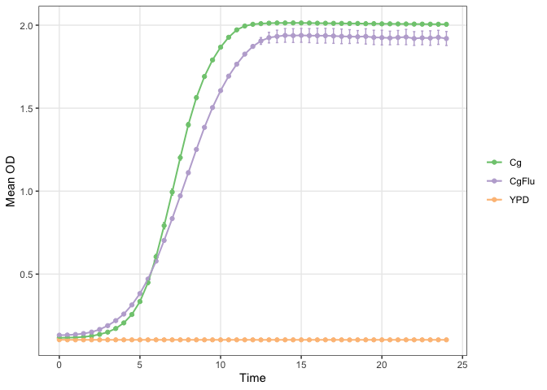

<!-- README.md is generated from README.rmd. Please edit that file -->

# growkar 

`growkar` is an R package for microbial growth curve analysis from
optical density (OD) time-series data. It provides a tidy workflow for
converting input data, validating growth measurements, plotting growth
curves, estimating growth rate and doubling time, detecting exponential
phase, and fitting logistic or Gompertz growth models.

The package keeps the feel of the original `growkar` workflow while
introducing a tidyverse-friendly v2 design built around canonical input
columns: `sample`, `time`, and `od`.

## Installation

``` r
remotes::install_github("sethiyap/growkar")
```

## Example dataset

``` r
library(growkar)
data(yeast_growth_data)

head(yeast_growth_data)
#> # A tibble: 6 × 10
#>    Time Cg_R1 Cg_R2 Cg_R3 CgFlu_R1 CgFlu_R2 CgFlu_R3 YPD_R1 YPD_R2 YPD_R3
#>   <dbl> <dbl> <dbl> <dbl>    <dbl>    <dbl>    <dbl>  <dbl>  <dbl>  <dbl>
#> 1   0   0.115 0.116 0.117    0.131    0.133    0.132  0.105  0.105  0.104
#> 2   0.5 0.116 0.118 0.117    0.132    0.133    0.134  0.104  0.104  0.104
#> 3   1   0.118 0.119 0.118    0.134    0.136    0.138  0.104  0.104  0.104
#> 4   1.5 0.121 0.123 0.121    0.139    0.142    0.144  0.104  0.104  0.104
#> 5   2   0.126 0.129 0.126    0.15     0.151    0.151  0.104  0.104  0.104
#> 6   2.5 0.136 0.139 0.136    0.165    0.168    0.166  0.104  0.104  0.104
```

## Convert data to tidy format

`as_tidy_growth_data()` converts growth data into the canonical tidy
format used throughout the package. The expected columns are `sample`,
`time`, and `od`. This is useful because the same structure can then be
reused for validation, plotting, empirical summaries, and model fitting.

``` r
tidy_data <- as_tidy_growth_data(yeast_growth_data)
head(tidy_data)
#> # A tibble: 6 × 5
#>    time sample      od condition replicate
#>   <dbl> <chr>    <dbl> <chr>     <chr>    
#> 1     0 Cg_R1    0.115 Cg        R1       
#> 2     0 Cg_R2    0.116 Cg        R2       
#> 3     0 Cg_R3    0.117 Cg        R3       
#> 4     0 CgFlu_R1 0.131 CgFlu     R1       
#> 5     0 CgFlu_R2 0.133 CgFlu     R2       
#> 6     0 CgFlu_R3 0.132 CgFlu     R3
```

## Plot growth curves

`plot_growth_curve()` visualizes OD over time and returns a `ggplot`
object. This preserves the clear ggplot-style output of the previous
version of `growkar` while using tidy input data. It is useful for quick
quality control and for comparing growth patterns across samples.

Because the output is a `ggplot` object, users can further customize the
figure with `ggplot2`.

``` r
p <- plot_growth_curve(tidy_data, average_replicates = TRUE)
p
```



## Validate tidy input

`validate_growth_data()` checks that tidy growth data contains the
required columns and valid values. This is useful before downstream
analysis so that problems are caught early.

``` r
validate_growth_data(tidy_data)
#> # A tibble: 441 × 5
#>     time sample      od condition replicate
#>    <dbl> <chr>    <dbl> <chr>     <chr>    
#>  1   0   Cg_R1    0.115 Cg        R1       
#>  2   0   Cg_R2    0.116 Cg        R2       
#>  3   0   Cg_R3    0.117 Cg        R3       
#>  4   0   CgFlu_R1 0.131 CgFlu     R1       
#>  5   0   CgFlu_R2 0.133 CgFlu     R2       
#>  6   0   CgFlu_R3 0.132 CgFlu     R3       
#>  7   0   YPD_R1   0.105 YPD       R1       
#>  8   0   YPD_R2   0.105 YPD       R2       
#>  9   0   YPD_R3   0.104 YPD       R3       
#> 10   0.5 Cg_R1    0.116 Cg        R1       
#> # ℹ 431 more rows
```

## Estimate growth rate

`compute_growth_rate()` estimates the specific growth rate from
`log(od)` versus time. It supports methods including `"rolling_window"`,
`"defined_interval"`, and `"rule_based"`. This is useful for estimating
exponential growth directly from observed data.

For a lightweight example, the code below uses the first sample in the
example dataset.

``` r
library(dplyr)
#> 
#> Attaching package: 'dplyr'
#> The following objects are masked from 'package:stats':
#> 
#>     filter, lag
#> The following objects are masked from 'package:base':
#> 
#>     intersect, setdiff, setequal, union

sample_id <- unique(tidy_data$sample)[1]

gr <- compute_growth_rate(
  filter(tidy_data, sample == sample_id),
  method = "rolling_window"
)

gr
#> # A tibble: 1 × 6
#>   sample    mu start_time end_time r_squared method        
#>   <chr>  <dbl>      <dbl>    <dbl>     <dbl> <chr>         
#> 1 Cg_R1  0.576        4.5      6.5     1.000 rolling_window
```

## Compute doubling time

`compute_doubling_time()` calculates doubling time from growth rate as
`log(2) / mu`. This is useful for biological interpretation of growth
kinetics.

``` r
compute_doubling_time(gr$mu)
#> [1] 1.204352
```

## Summarize growth metrics across samples

`summarize_growth_metrics()` computes growth rate and doubling time
across all samples. This is useful for comparing strains, conditions, or
replicates in one tidy summary table.

``` r
metrics <- summarize_growth_metrics(tidy_data)
metrics
#> # A tibble: 9 × 7
#>   sample          mu start_time end_time r_squared method         doubling_time
#>   <chr>        <dbl>      <dbl>    <dbl>     <dbl> <chr>                  <dbl>
#> 1 Cg_R1     5.76e- 1        4.5      6.5     1.000 rolling_window          1.20
#> 2 Cg_R2     5.60e- 1        4.5      6.5     1.000 rolling_window          1.24
#> 3 Cg_R3     5.71e- 1        4.5      6.5     0.999 rolling_window          1.21
#> 4 CgFlu_R1  4.03e- 1        4.5      6.5     1.000 rolling_window          1.72
#> 5 CgFlu_R2  4.07e- 1        4.5      6.5     1.000 rolling_window          1.70
#> 6 CgFlu_R3  4.03e- 1        4.5      6.5     1.000 rolling_window          1.72
#> 7 YPD_R1   -2.78e-16       22       24       0.670 rolling_window         NA   
#> 8 YPD_R2   -2.78e-16       22       24       0.670 rolling_window         NA   
#> 9 YPD_R3    3.86e- 3       18       20       0.5   rolling_window        179.
```

## Detect exponential phase

`detect_exponential_phase()` identifies likely exponential-phase windows
automatically. This is useful for understanding which time interval was
used for growth-rate estimation.

``` r
phase_tbl <- detect_exponential_phase(
  filter(tidy_data, sample == sample_id)
)

phase_tbl
#> # A tibble: 45 × 4
#>    start_time end_time slope r_squared
#>         <dbl>    <dbl> <dbl>     <dbl>
#>  1        4.5      6.5 0.576     1.000
#>  2        4        6   0.551     0.997
#>  3        5        7   0.551     0.997
#>  4        3.5      5.5 0.490     0.990
#>  5        5.5      7.5 0.490     0.991
#>  6        6        8   0.414     0.987
#>  7        3        5   0.409     0.985
#>  8        6.5      8.5 0.334     0.983
#>  9        2.5      4.5 0.321     0.975
#> 10        7        9   0.260     0.973
#> # ℹ 35 more rows
```

## Fit a growth model

`fit_growth_curve()` fits a logistic or Gompertz growth model to one
sample. This is useful when a smooth model-based summary of the full
growth curve is preferred over a purely empirical estimate.

``` r
fit <- fit_growth_curve(
  filter(tidy_data, sample == sample_id),
  model = "logistic"
)

fit
#> $model
#> [1] "logistic"
#> 
#> $fit
#> Nonlinear regression model
#>   model: od ~ K/(1 + exp(-r * (time - t0)))
#>    data: data
#>      K      r     t0 
#> 2.0271 0.7772 6.9688 
#>  residual sum-of-squares: 0.06883
#> 
#> Algorithm "port", convergence message: relative convergence (4)
#> 
#> $coefficients
#>         K         r        t0 
#> 2.0271408 0.7772492 6.9688283 
#> 
#> $fitted
#> # A tibble: 49 × 2
#>     time .fitted
#>    <dbl>   <dbl>
#>  1   0   0.00897
#>  2   0.5 0.0132 
#>  3   1   0.0194 
#>  4   1.5 0.0285 
#>  5   2   0.0417 
#>  6   2.5 0.0610 
#>  7   3   0.0887 
#>  8   3.5 0.128  
#>  9   4   0.183  
#> 10   4.5 0.259  
#> # ℹ 39 more rows
#> 
#> $data
#> # A tibble: 49 × 5
#>    sample  time    od condition replicate
#>    <chr>  <dbl> <dbl> <chr>     <chr>    
#>  1 Cg_R1    0   0.115 Cg        R1       
#>  2 Cg_R1    0.5 0.116 Cg        R1       
#>  3 Cg_R1    1   0.118 Cg        R1       
#>  4 Cg_R1    1.5 0.121 Cg        R1       
#>  5 Cg_R1    2   0.126 Cg        R1       
#>  6 Cg_R1    2.5 0.136 Cg        R1       
#>  7 Cg_R1    3   0.149 Cg        R1       
#>  8 Cg_R1    3.5 0.172 Cg        R1       
#>  9 Cg_R1    4   0.206 Cg        R1       
#> 10 Cg_R1    4.5 0.258 Cg        R1       
#> # ℹ 39 more rows
#> 
#> $converged
#> [1] TRUE
#> 
#> $sample
#> [1] "Cg_R1"
#> 
#> $message
#> NULL
#> 
#> attr(,"class")
#> [1] "growkar_fit"
```

## Extract fitted parameters

`extract_params()` extracts fitted coefficients and model-derived
quantities such as the asymptote and model-based doubling time. This is
useful for reporting fitted summaries in a tidy format.

``` r
params <- extract_params(fit)
params
#> # A tibble: 1 × 6
#>   sample model    asymptote     r    t0 doubling_time_model
#>   <chr>  <chr>        <dbl> <dbl> <dbl>               <dbl>
#> 1 Cg_R1  logistic      2.03 0.777  6.97               0.892
```

## Plot fitted curves

`plot_fitted_curve()` overlays observed OD points and the fitted growth
model, and returns a `ggplot` object. This is useful for visually
checking model fit quality.

Because the output is a `ggplot` object, users can further customize the
figure with `ggplot2`.

``` r
pf <- plot_fitted_curve(fit)
pf
```


## Workflow summary

A typical `growkar` v2 workflow is:

``` r
data(yeast_growth_data)

tidy_data <- as_tidy_growth_data(yeast_growth_data)
validate_growth_data(tidy_data)
#> # A tibble: 441 × 5
#>     time sample      od condition replicate
#>    <dbl> <chr>    <dbl> <chr>     <chr>    
#>  1   0   Cg_R1    0.115 Cg        R1       
#>  2   0   Cg_R2    0.116 Cg        R2       
#>  3   0   Cg_R3    0.117 Cg        R3       
#>  4   0   CgFlu_R1 0.131 CgFlu     R1       
#>  5   0   CgFlu_R2 0.133 CgFlu     R2       
#>  6   0   CgFlu_R3 0.132 CgFlu     R3       
#>  7   0   YPD_R1   0.105 YPD       R1       
#>  8   0   YPD_R2   0.105 YPD       R2       
#>  9   0   YPD_R3   0.104 YPD       R3       
#> 10   0.5 Cg_R1    0.116 Cg        R1       
#> # ℹ 431 more rows

plot_growth_curve(tidy_data)
```


``` r

metrics <- summarize_growth_metrics(tidy_data)
metrics
#> # A tibble: 9 × 7
#>   sample          mu start_time end_time r_squared method         doubling_time
#>   <chr>        <dbl>      <dbl>    <dbl>     <dbl> <chr>                  <dbl>
#> 1 Cg_R1     5.76e- 1        4.5      6.5     1.000 rolling_window          1.20
#> 2 Cg_R2     5.60e- 1        4.5      6.5     1.000 rolling_window          1.24
#> 3 Cg_R3     5.71e- 1        4.5      6.5     0.999 rolling_window          1.21
#> 4 CgFlu_R1  4.03e- 1        4.5      6.5     1.000 rolling_window          1.72
#> 5 CgFlu_R2  4.07e- 1        4.5      6.5     1.000 rolling_window          1.70
#> 6 CgFlu_R3  4.03e- 1        4.5      6.5     1.000 rolling_window          1.72
#> 7 YPD_R1   -2.78e-16       22       24       0.670 rolling_window         NA   
#> 8 YPD_R2   -2.78e-16       22       24       0.670 rolling_window         NA   
#> 9 YPD_R3    3.86e- 3       18       20       0.5   rolling_window        179.

sample_id <- unique(tidy_data$sample)[1]

fit <- fit_growth_curve(
  filter(tidy_data, sample == sample_id),
  model = "logistic"
)

extract_params(fit)
#> # A tibble: 1 × 6
#>   sample model    asymptote     r    t0 doubling_time_model
#>   <chr>  <chr>        <dbl> <dbl> <dbl>               <dbl>
#> 1 Cg_R1  logistic      2.03 0.777  6.97               0.892
plot_fitted_curve(fit)
```


## Development status

The `tidy_v2` branch introduces tidy input handling and model fitting
while preserving legacy growth-rate logic through compatibility wrappers
where practical.

## Contributing and issues

Bug reports, feature requests, and suggestions are welcome at:

<https://github.com/sethiyap/growkar/issues>

## License

MIT License
