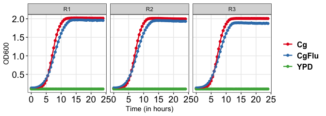
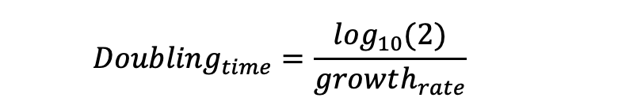

# growkar <a href='https://github.com/sethiyap/growkar/blob/master/hexasticker.jpg' target="_blank"></a>

<!-- <!-- badges: start -->

[](https://www.tidyverse.org/lifecycle/#experimental)
[](https://shields.io/category/platform-support) 
<!-- <!-- badges: end -->

`growkar` is an R-package to visualize and analyze growth curve data
from timely recorded optical density by spectrophotometers.

## Install

``` r
if(require("devtools")){
        devtools::install_github("sethiyap/growkar")
} else{
        install.packages("devtools")
        devtools::install_github("sethiyap/growkar")
}
```

## Plot growth curve

#### *Individual replicate*

``` r
growkar::plot_growth_curve(dat_growth_curve = growkar::yeast_growth_data, palette_name="Set1")
```



#### *With specific replicates*

``` r
growkar::plot_growth_curve(dat_growth_curve = growkar::yeast_growth_data, average_replicates = FALSE, select_replicates = c("R1", "R2"), palette_name="Set1")
```


#### *Average of replicates*

``` r
# Vertical lines represent standard deviation

growkar::plot_growth_curve(dat_growth_curve = growkar::yeast_growth_data, average_replicates = TRUE, palette_name="Set1")
```


## Computation of growth rate and generation time

Growth rates have often been used to evaluate the measure of fitness.
Logarithmic phase of the curve is used to determine the growth-rate.
Here, late lag-phase and early stationary-phase is defined as actively
dividing log-phase (as shown in figure).


Log-phase start `(T1)`: the time-point at which OD `(OD1)` is double to
that of the OD at the initial time-point (i.e., 0 hour) Log-phase end
`(T2)`: the time-point at which the OD `(OD2)` becomes twice of `OD1`.

Growth-rate is calculated as described in (Ng et al., 2016);


Growth rate (generation/hour); is the number of generations (doublings)
per hour.

Doubling time (or generation time); is the time taken by the population
to double:



The doubling time (minutes/doubling) is the reciprocal of the growth
rate.

### calculate\_growth\_rate

#### *Individual replicate*

``` r

cc <-  growkar::calculate_growth_rate(dat_growth_curve = growkar::yeast_growth_data)

knitr::kable(cc,"html", align = "l") %>%
    kableExtra::kable_styling(bootstrap_options = c("striped", "condensed", "responsive"), full_width = F,font_size =14,  stripe_color = "aquamarine3") %>%
    kableExtra::row_spec(0,bold = TRUE, italic = FALSE, color = "black") %>%
    kableExtra::column_spec(c(1, 5:6), bold=FALSE, color="blue")
```

<table class="table table-striped table-condensed table-responsive" style="font-size: 14px; width: auto !important; margin-left: auto; margin-right: auto;">

<thead>

<tr>

<th style="text-align:left;font-weight: bold;color: black !important;">

condition1

</th>

<th style="text-align:left;font-weight: bold;color: black !important;">

replicate1

</th>

<th style="text-align:left;font-weight: bold;color: black !important;">

time1

</th>

<th style="text-align:left;font-weight: bold;color: black !important;">

time2

</th>

<th style="text-align:left;font-weight: bold;color: black !important;">

growth\_rate

</th>

<th style="text-align:left;font-weight: bold;color: black !important;">

doubling\_time

</th>

</tr>

</thead>

<tbody>

<tr>

<td style="text-align:left;color: blue !important;">

Cg

</td>

<td style="text-align:left;">

R1

</td>

<td style="text-align:left;">

4.0

</td>

<td style="text-align:left;">

5.5

</td>

<td style="text-align:left;color: blue !important;">

0.531

</td>

<td style="text-align:left;color: blue !important;">

33.995

</td>

</tr>

<tr>

<td style="text-align:left;color: blue !important;">

Cg

</td>

<td style="text-align:left;">

R2

</td>

<td style="text-align:left;">

4.0

</td>

<td style="text-align:left;">

5.5

</td>

<td style="text-align:left;color: blue !important;">

0.515

</td>

<td style="text-align:left;color: blue !important;">

35.050

</td>

</tr>

<tr>

<td style="text-align:left;color: blue !important;">

Cg

</td>

<td style="text-align:left;">

R3

</td>

<td style="text-align:left;">

4.5

</td>

<td style="text-align:left;">

5.5

</td>

<td style="text-align:left;color: blue !important;">

0.556

</td>

<td style="text-align:left;color: blue !important;">

32.503

</td>

</tr>

<tr>

<td style="text-align:left;color: blue !important;">

CgFlu

</td>

<td style="text-align:left;">

R1

</td>

<td style="text-align:left;">

4.0

</td>

<td style="text-align:left;">

6.0

</td>

<td style="text-align:left;color: blue !important;">

0.396

</td>

<td style="text-align:left;color: blue !important;">

45.563

</td>

</tr>

<tr>

<td style="text-align:left;color: blue !important;">

CgFlu

</td>

<td style="text-align:left;">

R2

</td>

<td style="text-align:left;">

4.0

</td>

<td style="text-align:left;">

5.5

</td>

<td style="text-align:left;color: blue !important;">

0.399

</td>

<td style="text-align:left;color: blue !important;">

45.266

</td>

</tr>

<tr>

<td style="text-align:left;color: blue !important;">

CgFlu

</td>

<td style="text-align:left;">

R3

</td>

<td style="text-align:left;">

4.0

</td>

<td style="text-align:left;">

5.5

</td>

<td style="text-align:left;color: blue !important;">

0.400

</td>

<td style="text-align:left;color: blue !important;">

45.107

</td>

</tr>

<tr>

<td style="text-align:left;color: blue !important;">

YPD

</td>

<td style="text-align:left;">

R1

</td>

<td style="text-align:left;">

0.0

</td>

<td style="text-align:left;">

0.0

</td>

<td style="text-align:left;color: blue !important;">

NaN

</td>

<td style="text-align:left;color: blue !important;">

NaN

</td>

</tr>

<tr>

<td style="text-align:left;color: blue !important;">

YPD

</td>

<td style="text-align:left;">

R2

</td>

<td style="text-align:left;">

0.0

</td>

<td style="text-align:left;">

0.0

</td>

<td style="text-align:left;color: blue !important;">

NaN

</td>

<td style="text-align:left;color: blue !important;">

NaN

</td>

</tr>

<tr>

<td style="text-align:left;color: blue !important;">

YPD

</td>

<td style="text-align:left;">

R3

</td>

<td style="text-align:left;">

0.0

</td>

<td style="text-align:left;">

0.0

</td>

<td style="text-align:left;color: blue !important;">

NaN

</td>

<td style="text-align:left;color: blue !important;">

NaN

</td>

</tr>

</tbody>

</table>

#### *With specific replicates*

``` r

cc <- growkar::calculate_growth_rate(dat_growth_curve =     growkar::yeast_growth_data, average_replicates = FALSE, select_replicates = c("R1", "R2"))

knitr::kable(cc,"html", align = "l") %>%
    kableExtra::kable_styling(bootstrap_options = c("striped", "condensed", "responsive"), full_width = F,font_size =14,  stripe_color = "aquamarine3") %>%
    kableExtra::row_spec(0,bold = TRUE, italic = FALSE, color = "black") %>%
    kableExtra::column_spec(c(1,5:6), bold=FALSE, color="blue")
```

<table class="table table-striped table-condensed table-responsive" style="font-size: 14px; width: auto !important; margin-left: auto; margin-right: auto;">

<thead>

<tr>

<th style="text-align:left;font-weight: bold;color: black !important;">

condition1

</th>

<th style="text-align:left;font-weight: bold;color: black !important;">

replicate1

</th>

<th style="text-align:left;font-weight: bold;color: black !important;">

time1

</th>

<th style="text-align:left;font-weight: bold;color: black !important;">

time2

</th>

<th style="text-align:left;font-weight: bold;color: black !important;">

growth\_rate

</th>

<th style="text-align:left;font-weight: bold;color: black !important;">

doubling\_time

</th>

</tr>

</thead>

<tbody>

<tr>

<td style="text-align:left;color: blue !important;">

Cg

</td>

<td style="text-align:left;">

R1

</td>

<td style="text-align:left;">

4

</td>

<td style="text-align:left;">

5.5

</td>

<td style="text-align:left;color: blue !important;">

0.531

</td>

<td style="text-align:left;color: blue !important;">

33.995

</td>

</tr>

<tr>

<td style="text-align:left;color: blue !important;">

Cg

</td>

<td style="text-align:left;">

R2

</td>

<td style="text-align:left;">

4

</td>

<td style="text-align:left;">

5.5

</td>

<td style="text-align:left;color: blue !important;">

0.515

</td>

<td style="text-align:left;color: blue !important;">

35.050

</td>

</tr>

<tr>

<td style="text-align:left;color: blue !important;">

CgFlu

</td>

<td style="text-align:left;">

R1

</td>

<td style="text-align:left;">

4

</td>

<td style="text-align:left;">

6.0

</td>

<td style="text-align:left;color: blue !important;">

0.396

</td>

<td style="text-align:left;color: blue !important;">

45.563

</td>

</tr>

<tr>

<td style="text-align:left;color: blue !important;">

CgFlu

</td>

<td style="text-align:left;">

R2

</td>

<td style="text-align:left;">

4

</td>

<td style="text-align:left;">

5.5

</td>

<td style="text-align:left;color: blue !important;">

0.399

</td>

<td style="text-align:left;color: blue !important;">

45.266

</td>

</tr>

<tr>

<td style="text-align:left;color: blue !important;">

YPD

</td>

<td style="text-align:left;">

R1

</td>

<td style="text-align:left;">

0

</td>

<td style="text-align:left;">

0.0

</td>

<td style="text-align:left;color: blue !important;">

NaN

</td>

<td style="text-align:left;color: blue !important;">

NaN

</td>

</tr>

<tr>

<td style="text-align:left;color: blue !important;">

YPD

</td>

<td style="text-align:left;">

R2

</td>

<td style="text-align:left;">

0

</td>

<td style="text-align:left;">

0.0

</td>

<td style="text-align:left;color: blue !important;">

NaN

</td>

<td style="text-align:left;color: blue !important;">

NaN

</td>

</tr>

</tbody>

</table>

#### *Average of replicates*

``` r

cc <- growkar::calculate_growth_rate(dat_growth_curve = growkar::yeast_growth_data, average_replicates = TRUE)

knitr::kable(cc,"html", align = "l") %>%
    kableExtra::kable_styling(bootstrap_options = c("striped", "condensed", "responsive"), full_width = F,font_size =14,  stripe_color = "aquamarine3") %>%
    kableExtra::row_spec(0,bold = TRUE, italic = FALSE, color = "black") %>%
    kableExtra::column_spec(c(1, 4:5), bold=FALSE, color="blue")
```

<table class="table table-striped table-condensed table-responsive" style="font-size: 14px; width: auto !important; margin-left: auto; margin-right: auto;">

<thead>

<tr>

<th style="text-align:left;font-weight: bold;color: black !important;">

condition

</th>

<th style="text-align:left;font-weight: bold;color: black !important;">

time1

</th>

<th style="text-align:left;font-weight: bold;color: black !important;">

time2

</th>

<th style="text-align:left;font-weight: bold;color: black !important;">

growth\_rate

</th>

<th style="text-align:left;font-weight: bold;color: black !important;">

doubling\_time

</th>

</tr>

</thead>

<tbody>

<tr>

<td style="text-align:left;color: blue !important;">

Cg

</td>

<td style="text-align:left;">

4.5

</td>

<td style="text-align:left;">

5.5

</td>

<td style="text-align:left;color: blue !important;">

0.560

</td>

<td style="text-align:left;color: blue !important;">

32.248

</td>

</tr>

<tr>

<td style="text-align:left;color: blue !important;">

CgFlu

</td>

<td style="text-align:left;">

4.0

</td>

<td style="text-align:left;">

5.5

</td>

<td style="text-align:left;color: blue !important;">

0.397

</td>

<td style="text-align:left;color: blue !important;">

45.501

</td>

</tr>

<tr>

<td style="text-align:left;color: blue !important;">

YPD

</td>

<td style="text-align:left;">

0.0

</td>

<td style="text-align:left;">

0.0

</td>

<td style="text-align:left;color: blue !important;">

NaN

</td>

<td style="text-align:left;color: blue !important;">

NaN

</td>

</tr>

</tbody>

</table>

### calculate\_growthrate\_from\_defined\_time

Using user defined logphase start and end time-point growth rate and
generation time can be computed.

#### *Individual replicate*

``` r

# Load logphase start-end from local file

logphase_dat <- system.file("extdata", "logphase_for_replicates.txt", package = "growkar")
logphase_tibble <- readr::read_delim(logphase_dat, delim="\t", col_names = TRUE)

cc <-  growkar::calculate_growthrate_from_defined_time(dat_growth_curve = growkar::yeast_growth_data,logphase_tibble, average_replicates = FALSE)

knitr::kable(cc,"html", align = "l") %>%
    kableExtra::kable_styling(bootstrap_options = c("striped", "condensed", "responsive"), full_width = F,font_size =14,  stripe_color = "aquamarine3") %>%
    kableExtra::row_spec(0,bold = TRUE, italic = FALSE, color = "black") %>%
    kableExtra::column_spec(c(1, 5:6), bold=FALSE, color="blue")
```

<table class="table table-striped table-condensed table-responsive" style="font-size: 14px; width: auto !important; margin-left: auto; margin-right: auto;">

<thead>

<tr>

<th style="text-align:left;font-weight: bold;color: black !important;">

condition

</th>

<th style="text-align:left;font-weight: bold;color: black !important;">

replicate

</th>

<th style="text-align:left;font-weight: bold;color: black !important;">

Time1

</th>

<th style="text-align:left;font-weight: bold;color: black !important;">

Time2

</th>

<th style="text-align:left;font-weight: bold;color: black !important;">

growth\_rate

</th>

<th style="text-align:left;font-weight: bold;color: black !important;">

doubling\_time

</th>

</tr>

</thead>

<tbody>

<tr>

<td style="text-align:left;color: blue !important;">

Cg

</td>

<td style="text-align:left;">

R1

</td>

<td style="text-align:left;">

5.0

</td>

<td style="text-align:left;">

6.0

</td>

<td style="text-align:left;color: blue !important;">

0.597

</td>

<td style="text-align:left;color: blue !important;">

30

</td>

</tr>

<tr>

<td style="text-align:left;color: blue !important;">

Cg

</td>

<td style="text-align:left;">

R2

</td>

<td style="text-align:left;">

5.0

</td>

<td style="text-align:left;">

6.0

</td>

<td style="text-align:left;color: blue !important;">

0.577

</td>

<td style="text-align:left;color: blue !important;">

31

</td>

</tr>

<tr>

<td style="text-align:left;color: blue !important;">

Cg

</td>

<td style="text-align:left;">

R3

</td>

<td style="text-align:left;">

5.5

</td>

<td style="text-align:left;">

7.0

</td>

<td style="text-align:left;color: blue !important;">

0.538

</td>

<td style="text-align:left;color: blue !important;">

34

</td>

</tr>

<tr>

<td style="text-align:left;color: blue !important;">

CgFlu

</td>

<td style="text-align:left;">

R1

</td>

<td style="text-align:left;">

6.0

</td>

<td style="text-align:left;">

7.0

</td>

<td style="text-align:left;color: blue !important;">

0.370

</td>

<td style="text-align:left;color: blue !important;">

49

</td>

</tr>

<tr>

<td style="text-align:left;color: blue !important;">

CgFlu

</td>

<td style="text-align:left;">

R2

</td>

<td style="text-align:left;">

5.0

</td>

<td style="text-align:left;">

6.5

</td>

<td style="text-align:left;color: blue !important;">

0.408

</td>

<td style="text-align:left;color: blue !important;">

44

</td>

</tr>

<tr>

<td style="text-align:left;color: blue !important;">

CgFlu

</td>

<td style="text-align:left;">

R3

</td>

<td style="text-align:left;">

5.5

</td>

<td style="text-align:left;">

6.5

</td>

<td style="text-align:left;color: blue !important;">

0.397

</td>

<td style="text-align:left;color: blue !important;">

45

</td>

</tr>

<tr>

<td style="text-align:left;color: blue !important;">

YPD

</td>

<td style="text-align:left;">

R1

</td>

<td style="text-align:left;">

0.0

</td>

<td style="text-align:left;">

0.0

</td>

<td style="text-align:left;color: blue !important;">

NaN

</td>

<td style="text-align:left;color: blue !important;">

NaN

</td>

</tr>

<tr>

<td style="text-align:left;color: blue !important;">

YPD

</td>

<td style="text-align:left;">

R2

</td>

<td style="text-align:left;">

0.0

</td>

<td style="text-align:left;">

0.0

</td>

<td style="text-align:left;color: blue !important;">

NaN

</td>

<td style="text-align:left;color: blue !important;">

NaN

</td>

</tr>

<tr>

<td style="text-align:left;color: blue !important;">

YPD

</td>

<td style="text-align:left;">

R3

</td>

<td style="text-align:left;">

0.0

</td>

<td style="text-align:left;">

0.0

</td>

<td style="text-align:left;color: blue !important;">

NaN

</td>

<td style="text-align:left;color: blue !important;">

NaN

</td>

</tr>

</tbody>

</table>

#### *Average of replicates*

``` r

# Load logphase start-end from local file

logphase_dat <- system.file("extdata", "logphase_for_replicates.txt", package = "growkar")
logphase_tibble <- readr::read_delim(logphase_dat, delim="\t", col_names = TRUE)

cc <-  growkar::calculate_growthrate_from_defined_time(dat_growth_curve = growkar::yeast_growth_data,logphase_tibble, average_replicates = TRUE)

knitr::kable(cc,"html", align = "l") %>%
    kableExtra::kable_styling(bootstrap_options = c("striped", "condensed", "responsive"), full_width = F,font_size =14,  stripe_color = "aquamarine3") %>%
    kableExtra::row_spec(0,bold = TRUE, italic = FALSE, color = "black") %>%
    kableExtra::column_spec(c(1, 4:5), bold=FALSE, color="blue")
```

<table class="table table-striped table-condensed table-responsive" style="font-size: 14px; width: auto !important; margin-left: auto; margin-right: auto;">

<thead>

<tr>

<th style="text-align:left;font-weight: bold;color: black !important;">

condition

</th>

<th style="text-align:left;font-weight: bold;color: black !important;">

Time1

</th>

<th style="text-align:left;font-weight: bold;color: black !important;">

Time2

</th>

<th style="text-align:left;font-weight: bold;color: black !important;">

growth\_rate

</th>

<th style="text-align:left;font-weight: bold;color: black !important;">

doubling\_time

</th>

</tr>

</thead>

<tbody>

<tr>

<td style="text-align:left;color: blue !important;">

Cg

</td>

<td style="text-align:left;">

5.167

</td>

<td style="text-align:left;">

6.333

</td>

<td style="text-align:left;color: blue !important;">

0.582

</td>

<td style="text-align:left;color: blue !important;">

31

</td>

</tr>

<tr>

<td style="text-align:left;color: blue !important;">

CgFlu

</td>

<td style="text-align:left;">

5.500

</td>

<td style="text-align:left;">

6.667

</td>

<td style="text-align:left;color: blue !important;">

0.385

</td>

<td style="text-align:left;color: blue !important;">

47

</td>

</tr>

<tr>

<td style="text-align:left;color: blue !important;">

YPD

</td>

<td style="text-align:left;">

0.000

</td>

<td style="text-align:left;">

0.000

</td>

<td style="text-align:left;color: blue !important;">

NaN

</td>

<td style="text-align:left;color: blue !important;">

NaN

</td>

</tr>

</tbody>

</table>
