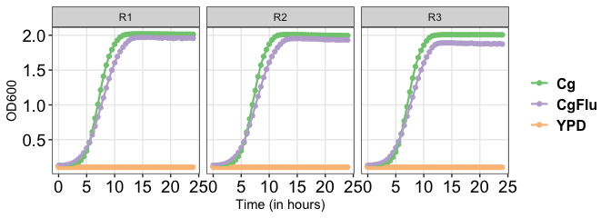

growkar
=======

<!-- badges: start -->
[](https://www.tidyverse.org/lifecycle/#experimental) -->
[](https://shields.io/category/platform-support) -->
<!-- badges: end -->
`growkar` is an R-package to visualize and analyze growth curve data from timely recorded optical density by spectrophotometers.

Install
-------

``` r
if(require("devtools")){
        devtools::install_github("sethiyap/growkar")
} else{
        install.packages("devtools")
        devtools::install_github("sethiyap/growkar")
}
```

Plot growth curve
-----------------

#### *Individual replicate*

``` r
growkar::plot_growth_curve(dat_growth_curve = growkar::yeast_growth_data)
```



#### *With specific replicates*

``` r
growkar::plot_growth_curve(dat_growth_curve = growkar::yeast_growth_data, average_replicates = FALSE, select_replicates = c("R1", "R2"))
```


#### *Average of replicates*

``` r
# Vertical lines represent standard deviation

growkar::plot_growth_curve(dat_growth_curve = growkar::yeast_growth_data, average_replicates = TRUE)
```


Computation of growth rate and generation time
----------------------------------------------

Growth rates have often been used to evaluate the measure of fitness. Logarithmic phase of the curve is used to determine the growth-rate. Here we define late lag-phase and early stationary-phase as actively dividing log-phase (as shown in figure).

``` r
knitr::include_graphics(path = "CgFlu.png")
```


Log-phase start `(T1)`: Time-point at which cells show OD `(OD1)` double to initial time-point. Log-phase end `(T2)`: Time-point from which cells OD `(OD2)` remains consistent.

Growth rate is calculated as


Growth rate which is the number of generations (doublings) per hour; Where, `multipicative_factor` determines number of cells at OD=1 for instance: for yeast cells with OD=1

1 = 3 \* 10<sup>7</sup>*c**e**l**l**s*

And Generation time; which is the time taken by the population to double:


The generation time is the reciprocal of the growth rate.

#### *Individual replicate*

``` r

cc <-  growkar::calculate_growth_rate(dat_growth_curve = growkar::yeast_growth_data)

knitr::kable(cc,"html", align = "l") %>%
    kableExtra::kable_styling(bootstrap_options = c("striped", "condensed", "responsive"), full_width = F,font_size =14,  stripe_color = "aquamarine3") %>%
    kableExtra::row_spec(0,bold = TRUE, italic = FALSE, color = "black") %>%
    kableExtra::column_spec(c(1, 5:6), bold=FALSE, color="blue")
```

<table class="table table-striped table-condensed table-responsive" style="font-size: 14px; width: auto !important; margin-left: auto; margin-right: auto;">
<thead>
<tr>
<th style="text-align:left;font-weight: bold;color: black !important;">
condition
</th>
<th style="text-align:left;font-weight: bold;color: black !important;">
replicate
</th>
<th style="text-align:left;font-weight: bold;color: black !important;">
logphase\_start
</th>
<th style="text-align:left;font-weight: bold;color: black !important;">
logphase\_end
</th>
<th style="text-align:left;font-weight: bold;color: black !important;">
growth\_rate
</th>
<th style="text-align:left;font-weight: bold;color: black !important;">
generation\_time
</th>
</tr>
</thead>
<tbody>
<tr>
<td style="text-align:left;color: blue !important;">
Cg
</td>
<td style="text-align:left;">
R1
</td>
<td style="text-align:left;">
4.0
</td>
<td style="text-align:left;">
13.5
</td>
<td style="text-align:left;color: blue !important;">
1.428
</td>
<td style="text-align:left;color: blue !important;">
42.025
</td>
</tr>
<tr>
<td style="text-align:left;color: blue !important;">
Cg
</td>
<td style="text-align:left;">
R2
</td>
<td style="text-align:left;">
4.0
</td>
<td style="text-align:left;">
13.0
</td>
<td style="text-align:left;color: blue !important;">
1.495
</td>
<td style="text-align:left;color: blue !important;">
40.122
</td>
</tr>
<tr>
<td style="text-align:left;color: blue !important;">
Cg
</td>
<td style="text-align:left;">
R3
</td>
<td style="text-align:left;">
4.5
</td>
<td style="text-align:left;">
12.0
</td>
<td style="text-align:left;color: blue !important;">
1.746
</td>
<td style="text-align:left;color: blue !important;">
34.371
</td>
</tr>
<tr>
<td style="text-align:left;color: blue !important;">
CgFlu
</td>
<td style="text-align:left;">
R1
</td>
<td style="text-align:left;">
4.0
</td>
<td style="text-align:left;">
14.0
</td>
<td style="text-align:left;color: blue !important;">
1.281
</td>
<td style="text-align:left;color: blue !important;">
46.845
</td>
</tr>
<tr>
<td style="text-align:left;color: blue !important;">
CgFlu
</td>
<td style="text-align:left;">
R2
</td>
<td style="text-align:left;">
4.0
</td>
<td style="text-align:left;">
14.0
</td>
<td style="text-align:left;color: blue !important;">
1.265
</td>
<td style="text-align:left;color: blue !important;">
47.426
</td>
</tr>
<tr>
<td style="text-align:left;color: blue !important;">
CgFlu
</td>
<td style="text-align:left;">
R3
</td>
<td style="text-align:left;">
4.0
</td>
<td style="text-align:left;">
13.5
</td>
<td style="text-align:left;color: blue !important;">
1.283
</td>
<td style="text-align:left;color: blue !important;">
46.768
</td>
</tr>
<tr>
<td style="text-align:left;color: blue !important;">
YPD
</td>
<td style="text-align:left;">
R1
</td>
<td style="text-align:left;">
0.0
</td>
<td style="text-align:left;">
0.0
</td>
<td style="text-align:left;color: blue !important;">
NaN
</td>
<td style="text-align:left;color: blue !important;">
NaN
</td>
</tr>
<tr>
<td style="text-align:left;color: blue !important;">
YPD
</td>
<td style="text-align:left;">
R2
</td>
<td style="text-align:left;">
0.0
</td>
<td style="text-align:left;">
0.0
</td>
<td style="text-align:left;color: blue !important;">
NaN
</td>
<td style="text-align:left;color: blue !important;">
NaN
</td>
</tr>
<tr>
<td style="text-align:left;color: blue !important;">
YPD
</td>
<td style="text-align:left;">
R3
</td>
<td style="text-align:left;">
0.0
</td>
<td style="text-align:left;">
0.0
</td>
<td style="text-align:left;color: blue !important;">
NaN
</td>
<td style="text-align:left;color: blue !important;">
NaN
</td>
</tr>
</tbody>
</table>
#### *With specific replicates*

``` r

cc <- growkar::calculate_growth_rate(dat_growth_curve =     growkar::yeast_growth_data, average_replicates = FALSE, select_replicates = c("R1", "R2"))

knitr::kable(cc,"html", align = "l") %>%
    kableExtra::kable_styling(bootstrap_options = c("striped", "condensed", "responsive"), full_width = F,font_size =14,  stripe_color = "aquamarine3") %>%
    kableExtra::row_spec(0,bold = TRUE, italic = FALSE, color = "black") %>%
    kableExtra::column_spec(c(1,5:6), bold=FALSE, color="blue")
```

<table class="table table-striped table-condensed table-responsive" style="font-size: 14px; width: auto !important; margin-left: auto; margin-right: auto;">
<thead>
<tr>
<th style="text-align:left;font-weight: bold;color: black !important;">
condition
</th>
<th style="text-align:left;font-weight: bold;color: black !important;">
replicate
</th>
<th style="text-align:left;font-weight: bold;color: black !important;">
logphase\_start
</th>
<th style="text-align:left;font-weight: bold;color: black !important;">
logphase\_end
</th>
<th style="text-align:left;font-weight: bold;color: black !important;">
growth\_rate
</th>
<th style="text-align:left;font-weight: bold;color: black !important;">
generation\_time
</th>
</tr>
</thead>
<tbody>
<tr>
<td style="text-align:left;color: blue !important;">
Cg
</td>
<td style="text-align:left;">
R1
</td>
<td style="text-align:left;">
4
</td>
<td style="text-align:left;">
13.5
</td>
<td style="text-align:left;color: blue !important;">
1.428
</td>
<td style="text-align:left;color: blue !important;">
42.025
</td>
</tr>
<tr>
<td style="text-align:left;color: blue !important;">
Cg
</td>
<td style="text-align:left;">
R2
</td>
<td style="text-align:left;">
4
</td>
<td style="text-align:left;">
13.0
</td>
<td style="text-align:left;color: blue !important;">
1.495
</td>
<td style="text-align:left;color: blue !important;">
40.122
</td>
</tr>
<tr>
<td style="text-align:left;color: blue !important;">
CgFlu
</td>
<td style="text-align:left;">
R1
</td>
<td style="text-align:left;">
4
</td>
<td style="text-align:left;">
14.0
</td>
<td style="text-align:left;color: blue !important;">
1.281
</td>
<td style="text-align:left;color: blue !important;">
46.845
</td>
</tr>
<tr>
<td style="text-align:left;color: blue !important;">
CgFlu
</td>
<td style="text-align:left;">
R2
</td>
<td style="text-align:left;">
4
</td>
<td style="text-align:left;">
14.0
</td>
<td style="text-align:left;color: blue !important;">
1.265
</td>
<td style="text-align:left;color: blue !important;">
47.426
</td>
</tr>
<tr>
<td style="text-align:left;color: blue !important;">
YPD
</td>
<td style="text-align:left;">
R1
</td>
<td style="text-align:left;">
0
</td>
<td style="text-align:left;">
0.0
</td>
<td style="text-align:left;color: blue !important;">
NaN
</td>
<td style="text-align:left;color: blue !important;">
NaN
</td>
</tr>
<tr>
<td style="text-align:left;color: blue !important;">
YPD
</td>
<td style="text-align:left;">
R2
</td>
<td style="text-align:left;">
0
</td>
<td style="text-align:left;">
0.0
</td>
<td style="text-align:left;color: blue !important;">
NaN
</td>
<td style="text-align:left;color: blue !important;">
NaN
</td>
</tr>
</tbody>
</table>
#### *Average of replicates*

``` r

cc <- growkar::calculate_growth_rate(dat_growth_curve = growkar::yeast_growth_data, average_replicates = TRUE)

knitr::kable(cc,"html", align = "l") %>%
    kableExtra::kable_styling(bootstrap_options = c("striped", "condensed", "responsive"), full_width = F,font_size =14,  stripe_color = "aquamarine3") %>%
    kableExtra::row_spec(0,bold = TRUE, italic = FALSE, color = "black") %>%
    kableExtra::column_spec(c(1, 4:5), bold=FALSE, color="blue")
```

<table class="table table-striped table-condensed table-responsive" style="font-size: 14px; width: auto !important; margin-left: auto; margin-right: auto;">
<thead>
<tr>
<th style="text-align:left;font-weight: bold;color: black !important;">
condition
</th>
<th style="text-align:left;font-weight: bold;color: black !important;">
logphase\_start
</th>
<th style="text-align:left;font-weight: bold;color: black !important;">
logphase\_end
</th>
<th style="text-align:left;font-weight: bold;color: black !important;">
growth\_rate
</th>
<th style="text-align:left;font-weight: bold;color: black !important;">
generation\_time
</th>
</tr>
</thead>
<tbody>
<tr>
<td style="text-align:left;color: blue !important;">
Cg
</td>
<td style="text-align:left;">
4.5
</td>
<td style="text-align:left;">
13.0
</td>
<td style="text-align:left;color: blue !important;">
1.544
</td>
<td style="text-align:left;color: blue !important;">
38.858
</td>
</tr>
<tr>
<td style="text-align:left;color: blue !important;">
CgFlu
</td>
<td style="text-align:left;">
4.0
</td>
<td style="text-align:left;">
13.5
</td>
<td style="text-align:left;color: blue !important;">
1.317
</td>
<td style="text-align:left;color: blue !important;">
45.566
</td>
</tr>
<tr>
<td style="text-align:left;color: blue !important;">
YPD
</td>
<td style="text-align:left;">
0.0
</td>
<td style="text-align:left;">
0.0
</td>
<td style="text-align:left;color: blue !important;">
NaN
</td>
<td style="text-align:left;color: blue !important;">
NaN
</td>
</tr>
</tbody>
</table>
