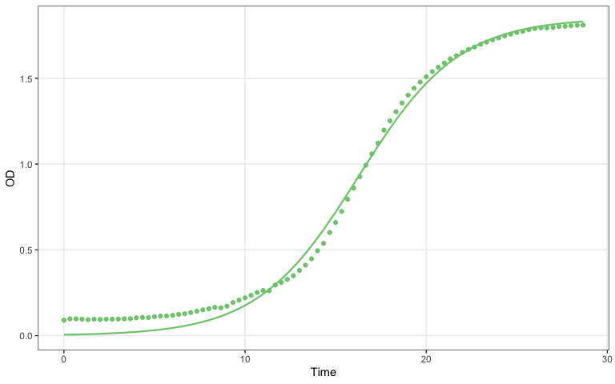

CnH2O2 growkar workflow example
================

``` r
knitr::opts_chunk$set(
  collapse = TRUE,
  comment = "#>",
  fig.path = "dd-growkar-workflow-files/figure-gfm/"
)

if (requireNamespace("pkgload", quietly = TRUE) && file.exists("DESCRIPTION")) {
  pkg_root <- "."
} else {
  candidates <- c(".", "..", "../..")
  match_idx <- which(file.exists(file.path(candidates, "DESCRIPTION")))
  pkg_root <- if (length(match_idx) > 0L) candidates[[match_idx[[1]]]] else NULL
}

if (!is.null(pkg_root) && requireNamespace("pkgload", quietly = TRUE)) {
  pkgload::load_all(pkg_root, export_all = FALSE, helpers = FALSE, quiet = TRUE)
}

library(growkar)
library(dplyr)
library(knitr)
```

## Prepare data

This example reads `CnH2O2_OD.txt`, converts it to the canonical tidy
format used by `growkar`, and validates the result.

``` r
dd_path <- if (file.exists("CnH2O2_OD.txt")) {
  "CnH2O2_OD.txt"
} else {
  system.file("extdata", "CnH2O2_OD.txt", package = "growkar")
}

dd <- read.delim(dd_path, check.names = FALSE)
tidy_dd <- as_tidy_growth_data(dd)
validate_growth_data(tidy_dd)
#> # A tibble: 2,088 × 5
#>     time sample           od condition   replicate
#>    <dbl> <chr>         <dbl> <chr>       <chr>    
#>  1     0 H2O2(8.8mM)_1 0.094 H2O2(8.8mM) 1        
#>  2     0 H2O2(8.8mM)_2 0.102 H2O2(8.8mM) 2        
#>  3     0 H2O2(8.8mM)_3 0.102 H2O2(8.8mM) 3        
#>  4     0 H2O2(4.4mM)_1 0.091 H2O2(4.4mM) 1        
#>  5     0 H2O2(4.4mM)_2 0.102 H2O2(4.4mM) 2        
#>  6     0 H2O2(4.4mM)_3 0.109 H2O2(4.4mM) 3        
#>  7     0 H2O2(2.2mM)_1 0.091 H2O2(2.2mM) 1        
#>  8     0 H2O2(2.2mM)_2 0.103 H2O2(2.2mM) 2        
#>  9     0 H2O2(2.2mM)_3 0.102 H2O2(2.2mM) 3        
#> 10     0 H2O2(1.1mM)_1 0.09  H2O2(1.1mM) 1        
#> # ℹ 2,078 more rows

head(tidy_dd)
#> # A tibble: 6 × 5
#>    time sample           od condition   replicate
#>   <dbl> <chr>         <dbl> <chr>       <chr>    
#> 1     0 H2O2(8.8mM)_1 0.094 H2O2(8.8mM) 1        
#> 2     0 H2O2(8.8mM)_2 0.102 H2O2(8.8mM) 2        
#> 3     0 H2O2(8.8mM)_3 0.102 H2O2(8.8mM) 3        
#> 4     0 H2O2(4.4mM)_1 0.091 H2O2(4.4mM) 1        
#> 5     0 H2O2(4.4mM)_2 0.102 H2O2(4.4mM) 2        
#> 6     0 H2O2(4.4mM)_3 0.109 H2O2(4.4mM) 3
```

## Plot growth curves with averaged replicates

This plot averages replicates within each condition and returns a
`ggplot2` object that can be customized further if needed.

``` r
plot_growth_curve(
  tidy_dd,
  average_replicates = TRUE,
  colour_col = "condition",
  palette_name = "Dark2"
)
```

<!-- -->

## Summarize doubling time with H2O2(0mM) as the reference

This summary compares replicate-level doubling times for each condition
against `H2O2(0mM)` and uses the default Benjamini-Hochberg adjustment
for p-values.

``` r
dt_stats <- summarize_growth_metrics(
  tidy_dd,
  method = "rolling_window",
  comparison_col = "condition",
  compare_to = "H2O2(0mM)"
)

knitr::kable(dt_stats, digits = 3)
```

| condition | mean_mu | mean_doubling_time | sd_doubling_time | n_replicates | error_bar | p_value | p_value_adjusted | p_value_label |
|:---|---:|---:|---:|---:|---:|---:|---:|:---|
| H2O2(0.135mM) | 0.272 | 2.594 | 0.415 | 3 | 0.240 | 0.511 | 0.715 | ns |
| H2O2(0.275mM) | 0.270 | 2.597 | 0.366 | 3 | 0.212 | 0.466 | 0.715 | ns |
| H2O2(0.55mM) | 0.285 | 2.451 | 0.229 | 3 | 0.132 | 0.765 | 0.882 | ns |
| H2O2(0mM) | 0.292 | 2.388 | 0.253 | 3 | 0.146 | NA | NA | ref |
| H2O2(1.1mM) | 0.297 | 2.355 | 0.252 | 3 | 0.146 | 0.882 | 0.882 | ns |
| H2O2(2.2mM) | 0.315 | 2.204 | 0.077 | 3 | 0.045 | 0.335 | 0.715 | ns |
| H2O2(4.4mM) | 0.019 | 53.331 | 30.353 | 3 | 17.524 | 0.101 | 0.651 | ns |
| H2O2(8.8mM) | 0.049 | 60.095 | 50.447 | 3 | 29.126 | 0.186 | 0.651 | ns |

## Plot doubling time comparisons

This plot shows mean doubling time with error bars and comparison
brackets against `H2O2(0mM)`.

``` r
plot_doubling_time(
  tidy_dd,
  comparison_col = "condition",
  compare_to = "H2O2(0mM)",
  palette_name = "Dark2"
)
```

<!-- -->

## Fit and plot one representative growth curve

This section fits a logistic model to the first sample in the reference
condition and overlays observed and fitted values.

``` r
sample_to_fit <- tidy_dd |>
  filter(condition == "H2O2(0mM)") |>
  distinct(sample) |>
  slice(1) |>
  pull(sample)

fit <- tidy_dd |>
  filter(sample == sample_to_fit) |>
  fit_growth_curve(model = "logistic")

extract_params(fit)
#> # A tibble: 1 × 6
#>   sample      model    asymptote     r    t0 doubling_time_model
#>   <chr>       <chr>        <dbl> <dbl> <dbl>               <dbl>
#> 1 H2O2(0mM)_1 logistic      1.85 0.360  16.3                1.92
```

``` r
plot_fitted_curve(fit)
```

<!-- -->
