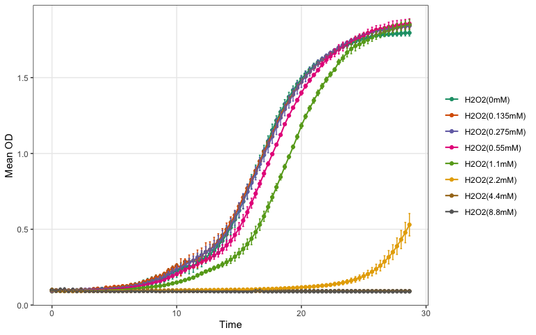
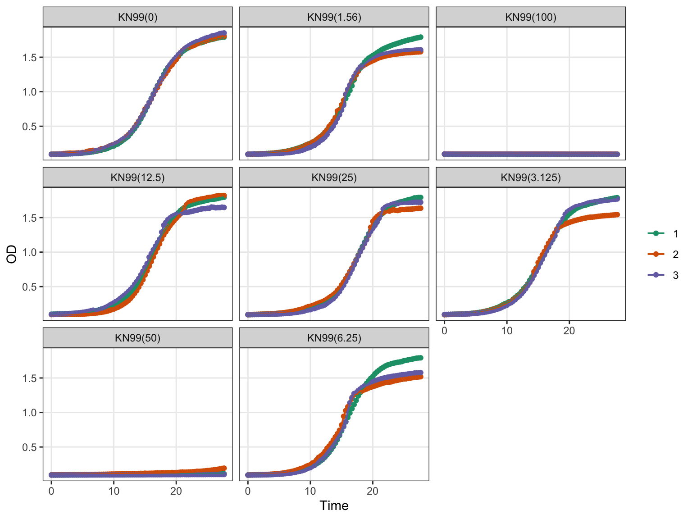
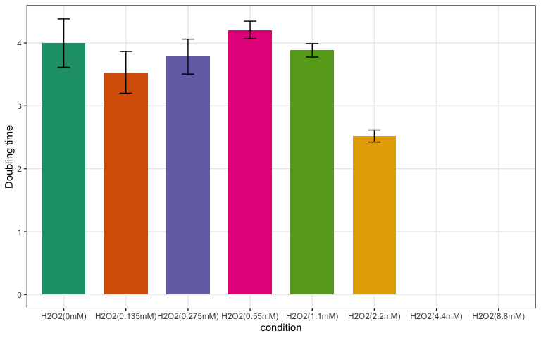

KN99 CDK7 growkar workflow example
================

``` r
knitr::opts_chunk$set(
  collapse = TRUE,
  comment = "#>",
  fig.path = "dd-growkar-workflow-files/figure-gfm/"
)

if (requireNamespace("pkgload", quietly = TRUE) && file.exists("DESCRIPTION")) {
  pkg_root <- "."
} else {
  candidates <- c(".", "..", "../..")
  match_idx <- which(file.exists(file.path(candidates, "DESCRIPTION")))
  pkg_root <- if (length(match_idx) > 0L) candidates[[match_idx[[1]]]] else NULL
}

if (!is.null(pkg_root) && requireNamespace("pkgload", quietly = TRUE)) {
  pkgload::load_all(pkg_root, export_all = FALSE, helpers = FALSE, quiet = TRUE)
}

library(growkar)
library(dplyr)
library(knitr)
```

## Import and validate data

This example reads `dose_response_BS181_20Dec24_Cdk7Tag.txt`, converts
it to the canonical tidy format used by `growkar`, and validates the
result.

``` r
dd_path <- if (file.exists("dose_response_BS181_20Dec24_Cdk7Tag.txt")) {
  "dose_response_BS181_20Dec24_Cdk7Tag.txt"
} else {
  system.file("extdata", "dose_response_BS181_20Dec24_Cdk7Tag.txt", package = "growkar")
}

dd <- read.delim(dd_path, check.names = FALSE)
tidy_dd <- as_tidy_growth_data(dd)
validate_growth_data(tidy_dd)
#> # A tibble: 8,064 × 5
#>     time sample           od condition   replicate
#>    <dbl> <chr>         <dbl> <chr>       <chr>    
#>  1     0 KN99(100)_1   0.096 KN99(100)   1        
#>  2     0 KN99(100)_2   0.098 KN99(100)   2        
#>  3     0 KN99(100)_3   0.097 KN99(100)   3        
#>  4     0 CM2444(100)_1 0.096 CM2444(100) 1        
#>  5     0 CM2444(100)_2 0.096 CM2444(100) 2        
#>  6     0 CM2444(100)_3 0.097 CM2444(100) 3        
#>  7     0 CM2446(100)_1 0.099 CM2446(100) 1        
#>  8     0 CM2446(100)_2 0.099 CM2446(100) 2        
#>  9     0 CM2446(100)_3 0.097 CM2446(100) 3        
#> 10     0 CM2448(100)_1 0.098 CM2448(100) 1        
#> # ℹ 8,054 more rows

head(tidy_dd)
#> # A tibble: 6 × 5
#>    time sample           od condition   replicate
#>   <dbl> <chr>         <dbl> <chr>       <chr>    
#> 1     0 KN99(100)_1   0.096 KN99(100)   1        
#> 2     0 KN99(100)_2   0.098 KN99(100)   2        
#> 3     0 KN99(100)_3   0.097 KN99(100)   3        
#> 4     0 CM2444(100)_1 0.096 CM2444(100) 1        
#> 5     0 CM2444(100)_2 0.096 CM2444(100) 2        
#> 6     0 CM2444(100)_3 0.097 CM2444(100) 3
```

## Create the canonical SummarizedExperiment

`growkar` can also package the processed data into a lightweight
`growkar_data` object and coerce it into a `SummarizedExperiment` for
Bioconductor-oriented workflows. After creating the canonical
`SummarizedExperiment`, this example keeps only the `KN99` samples.

``` r
growkar_obj <- as_growkar(tidy_dd)
se <- methods::as(growkar_obj, "SummarizedExperiment")

keep_kn99 <- grepl("^KN99", SummarizedExperiment::colData(se)$sample)
se <- se[, keep_kn99]

se
#> class: SummarizedExperiment 
#> dim: 84 24 
#> metadata(2): growkar_schema growth_metrics
#> assays(1): od
#> rownames(84): 0 0.333333333333333 ... 27.3336111111111 27.6669444444444
#> rowData names(1): time
#> colnames(24): KN99(100)_1 KN99(100)_2 ... KN99(0)_2 KN99(0)_3
#> colData names(3): sample condition replicate
```

## Analyze using SummarizedExperiment metadata

The same doubling-time summary can be computed directly on the
`SummarizedExperiment` object and stored in
`metadata(se)$growth_metrics`.

``` r
se <- growth_metrics(
  se,
  method = "rolling_window",
  comparison_col = "condition",
  compare_to = "KN99(0)"
)

se_metrics <- S4Vectors::metadata(se)$growth_metrics

knitr::kable(se_metrics, digits = 3)
```

| condition | mean_mu | mean_doubling_time | sd_doubling_time | n_replicates | error_bar | p_value | p_value_label |
|:---|---:|---:|---:|---:|---:|---:|:---|
| KN99(0) | 0.262 | 2.646 | 0.037 | 3 | 0.021 | NA | ref |
| KN99(1.56) | 0.290 | 2.431 | 0.378 | 3 | 0.218 | 0.430 | ns |
| KN99(100) | 0.010 | 72.780 | 0.770 | 3 | 0.445 | 0.000 | \*\*\*\* |
| KN99(12.5) | 0.271 | 2.584 | 0.330 | 3 | 0.190 | 0.778 | ns |
| KN99(25) | 0.266 | 2.621 | 0.201 | 3 | 0.116 | 0.850 | ns |
| KN99(3.125) | 0.273 | 2.569 | 0.318 | 3 | 0.183 | 0.719 | ns |
| KN99(50) | 0.037 | 42.852 | 33.020 | 3 | 19.064 | 0.169 | ns |
| KN99(6.25) | 0.308 | 2.263 | 0.206 | 3 | 0.119 | 0.080 | ns |

## Plot growth curves with averaged replicates

This plot uses the averaged replicate trajectories for each condition
and returns a `ggplot2` object that can be customized further if needed.

``` r
plot_growth_curve(
  se,
  average_replicates = TRUE,
  colour_col = "condition",
  palette_name = "Dark2"
)
```

<!-- -->

## Plot growth curves as facets

For complex datasets with multiple conditions such as `KN99(...)` and
`CM2448(...)`, `plot_growth_curve_facets()` creates one facet per
condition automatically.

``` r
plot_growth_curve_facets(
  se,
  colour_col = "replicate",
  palette_name = "Dark2"
)
```

<!-- -->

## Summarize doubling time with KN99(0) as the reference

This summary compares replicate-level doubling times for each condition
against `KN99(0)` using the rolling-window exponential interval.

``` r
dt_stats <- summarize_growth_metrics(
  se,
  method = "rolling_window",
  comparison_col = "condition",
  compare_to = "KN99(0)"
)

knitr::kable(dt_stats, digits = 3)
```

| condition | mean_mu | mean_doubling_time | sd_doubling_time | n_replicates | error_bar | p_value | p_value_label |
|:---|---:|---:|---:|---:|---:|---:|:---|
| KN99(0) | 0.262 | 2.646 | 0.037 | 3 | 0.021 | NA | ref |
| KN99(1.56) | 0.290 | 2.431 | 0.378 | 3 | 0.218 | 0.430 | ns |
| KN99(100) | 0.010 | 72.780 | 0.770 | 3 | 0.445 | 0.000 | \*\*\*\* |
| KN99(12.5) | 0.271 | 2.584 | 0.330 | 3 | 0.190 | 0.778 | ns |
| KN99(25) | 0.266 | 2.621 | 0.201 | 3 | 0.116 | 0.850 | ns |
| KN99(3.125) | 0.273 | 2.569 | 0.318 | 3 | 0.183 | 0.719 | ns |
| KN99(50) | 0.037 | 42.852 | 33.020 | 3 | 19.064 | 0.169 | ns |
| KN99(6.25) | 0.308 | 2.263 | 0.206 | 3 | 0.119 | 0.080 | ns |

## Plot doubling time comparisons

This plot shows mean doubling time with error bars and comparison
brackets against `KN99(0)` using the rolling-window exponential
interval.

``` r
plot_doubling_time(
  se,
  comparison_col = "condition",
  compare_to = "KN99(0)",
  method = "rolling_window",
  palette_name = "Dark2"
)
```

<!-- -->
