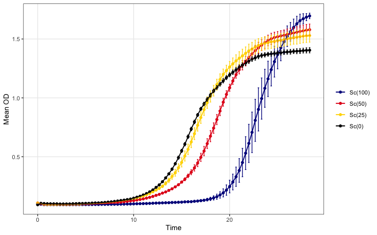
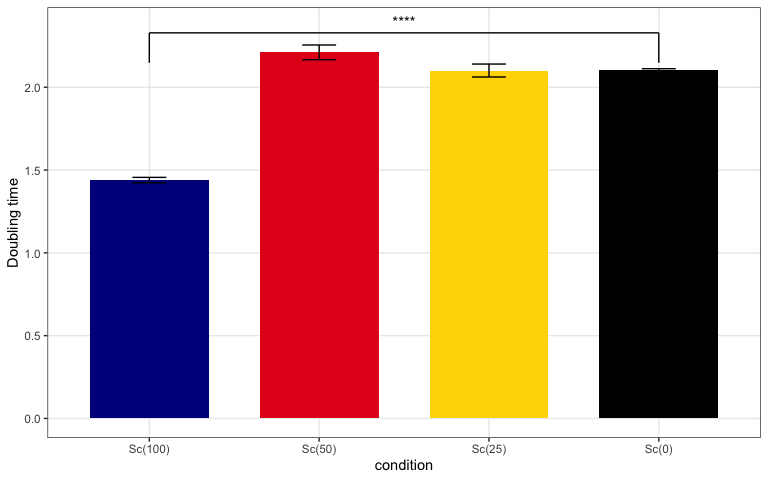

ScBS181 growkar workflow example
================

``` r
knitr::opts_chunk$set(
  collapse = TRUE,
  comment = "#>",
  fig.path = "scbs181-growkar-workflow-files/figure-gfm/"
)

if (requireNamespace("pkgload", quietly = TRUE) && file.exists("DESCRIPTION")) {
  pkg_root <- "."
} else {
  candidates <- c(".", "..", "../..")
  match_idx <- which(file.exists(file.path(candidates, "DESCRIPTION")))
  pkg_root <- if (length(match_idx) > 0L) candidates[[match_idx[[1]]]] else NULL
}

if (!is.null(pkg_root) && requireNamespace("pkgload", quietly = TRUE)) {
  pkgload::load_all(pkg_root, export_all = FALSE, helpers = FALSE, quiet = TRUE)
}

library(growkar)
library(dplyr)
library(knitr)

sc_colors <- c("blue4", "#E41A1C", "gold", "black")
```

## Import and validate data

This example reads `ScBS181_OD.txt`, converts it to the canonical tidy
format used by `growkar`, and validates the result.

``` r
sc_path <- if (file.exists("ScBS181_OD.txt")) {
  "ScBS181_OD.txt"
} else {
  system.file("extdata", "ScBS181_OD.txt", package = "growkar")
}

sc_raw <- read.delim(sc_path, check.names = FALSE)
tidy_sc <- as_tidy_growth_data(sc_raw)
validate_growth_data(tidy_sc)
#> # A tibble: 2,064 × 5
#>     time sample        od condition replicate
#>    <dbl> <chr>      <dbl> <chr>     <chr>    
#>  1     0 Sc(100)_1  0.095 Sc(100)   1        
#>  2     0 Sc(100)_2  0.099 Sc(100)   2        
#>  3     0 Sc(100)_3  0.099 Sc(100)   3        
#>  4     0 Sc(50)_1   0.106 Sc(50)    1        
#>  5     0 Sc(50)_2   0.106 Sc(50)    2        
#>  6     0 Sc(50)_3   0.11  Sc(50)    3        
#>  7     0 Sc(25)_1   0.107 Sc(25)    1        
#>  8     0 Sc(25)_2   0.106 Sc(25)    2        
#>  9     0 Sc(25)_3   0.107 Sc(25)    3        
#> 10     0 Sc(12.5)_1 0.105 Sc(12.5)  1        
#> # ℹ 2,054 more rows

sc_levels <- tidy_sc |>
  dplyr::distinct(condition) |>
  dplyr::mutate(
    concentration = as.numeric(sub("^Sc\\(([-0-9.]+)\\)$", "\\1", .data$condition))
  ) |>
  dplyr::arrange(.data$concentration) |>
  dplyr::pull(condition)

tidy_sc <- dplyr::mutate(
  tidy_sc,
  condition = factor(.data$condition, levels = sc_levels)
)

selected_conditions <- c("Sc(100)", "Sc(50)", "Sc(25)", "Sc(0)")

tidy_sc <- tidy_sc |>
  dplyr::filter(.data$condition %in% selected_conditions) |>
  dplyr::mutate(condition = factor(.data$condition, levels = selected_conditions))

head(tidy_sc)
#> # A tibble: 6 × 5
#>    time sample       od condition replicate
#>   <dbl> <chr>     <dbl> <fct>     <chr>    
#> 1     0 Sc(100)_1 0.095 Sc(100)   1        
#> 2     0 Sc(100)_2 0.099 Sc(100)   2        
#> 3     0 Sc(100)_3 0.099 Sc(100)   3        
#> 4     0 Sc(50)_1  0.106 Sc(50)    1        
#> 5     0 Sc(50)_2  0.106 Sc(50)    2        
#> 6     0 Sc(50)_3  0.11  Sc(50)    3
```

## Create the canonical SummarizedExperiment

`growkar` can also package the processed data into a lightweight
`growkar_data` object and coerce it into a `SummarizedExperiment` for
Bioconductor-oriented workflows.

``` r
growkar_obj <- as_growkar(tidy_sc)
se <- methods::as(growkar_obj, "SummarizedExperiment")
se
#> class: SummarizedExperiment 
#> dim: 86 12 
#> metadata(2): growkar_schema growth_metrics
#> assays(1): od
#> rownames(86): 0 0.333333333333333 ... 28.0005555555556 28.3338888888889
#> rowData names(1): time
#> colnames(12): Sc(0)_1 Sc(0)_2 ... Sc(50)_2 Sc(50)_3
#> colData names(3): sample condition replicate
```

## Analyze using SummarizedExperiment metadata

The rolling-window doubling-time summary can also be computed directly
on the `SummarizedExperiment` object and retrieved from
`metadata(se)$growth_metrics`.

``` r
se <- growth_metrics(
  se,
  method = "rolling_window",
  comparison_col = "condition",
  compare_to = "Sc(0)"
)

se_metrics <- S4Vectors::metadata(se)$growth_metrics |>
  dplyr::mutate(condition = factor(.data$condition, levels = selected_conditions)) |>
  dplyr::arrange(.data$condition)

knitr::kable(se_metrics, digits = 3)
```

| condition | mean_mu | mean_doubling_time | sd_doubling_time | n_replicates | error_bar | p_value | p_value_label |
|:---|---:|---:|---:|---:|---:|---:|:---|
| Sc(100) | 0.482 | 1.440 | 0.028 | 3 | 0.016 | 0.000 | \*\*\*\* |
| Sc(50) | 0.314 | 2.211 | 0.077 | 3 | 0.044 | 0.132 | ns |
| Sc(25) | 0.330 | 2.101 | 0.068 | 3 | 0.039 | 0.959 | ns |
| Sc(0) | 0.330 | 2.103 | 0.015 | 3 | 0.009 | 1.000 | ref |

## Plot growth curves with averaged replicates

``` r
plot_growth_curve(
  se,
  average_replicates = TRUE,
  colour_col = "condition",
  custom_colors = sc_colors
)
```

<!-- -->

## Summarize doubling time from averaged replicates

This summary computes replicate-level doubling times for the selected Sc
conditions using the rolling-window method.

``` r
dt_stats <- summarize_growth_metrics(
  se,
  method = "rolling_window",
  comparison_col = "condition",
  compare_to = "Sc(0)"
)

dt_stats <- dt_stats |>
  dplyr::mutate(condition = factor(.data$condition, levels = selected_conditions)) |>
  dplyr::arrange(.data$condition)

knitr::kable(dt_stats, digits = 3)
```

| condition | mean_mu | mean_doubling_time | sd_doubling_time | n_replicates | error_bar | p_value | p_value_label |
|:---|---:|---:|---:|---:|---:|---:|:---|
| Sc(100) | 0.482 | 1.440 | 0.028 | 3 | 0.016 | 0.000 | \*\*\*\* |
| Sc(50) | 0.314 | 2.211 | 0.077 | 3 | 0.044 | 0.132 | ns |
| Sc(25) | 0.330 | 2.101 | 0.068 | 3 | 0.039 | 0.959 | ns |
| Sc(0) | 0.330 | 2.103 | 0.015 | 3 | 0.009 | 1.000 | ref |

## Plot doubling time with error bars and p-value annotations

``` r
plot_doubling_time(
  se,
  comparison_col = "condition",
  compare_to = "Sc(0)",
  average_replicates = FALSE,
  method = "rolling_window",
  custom_colors = sc_colors
)
```

<!-- -->
